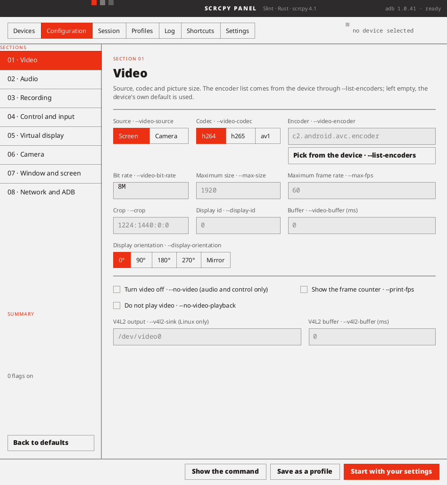
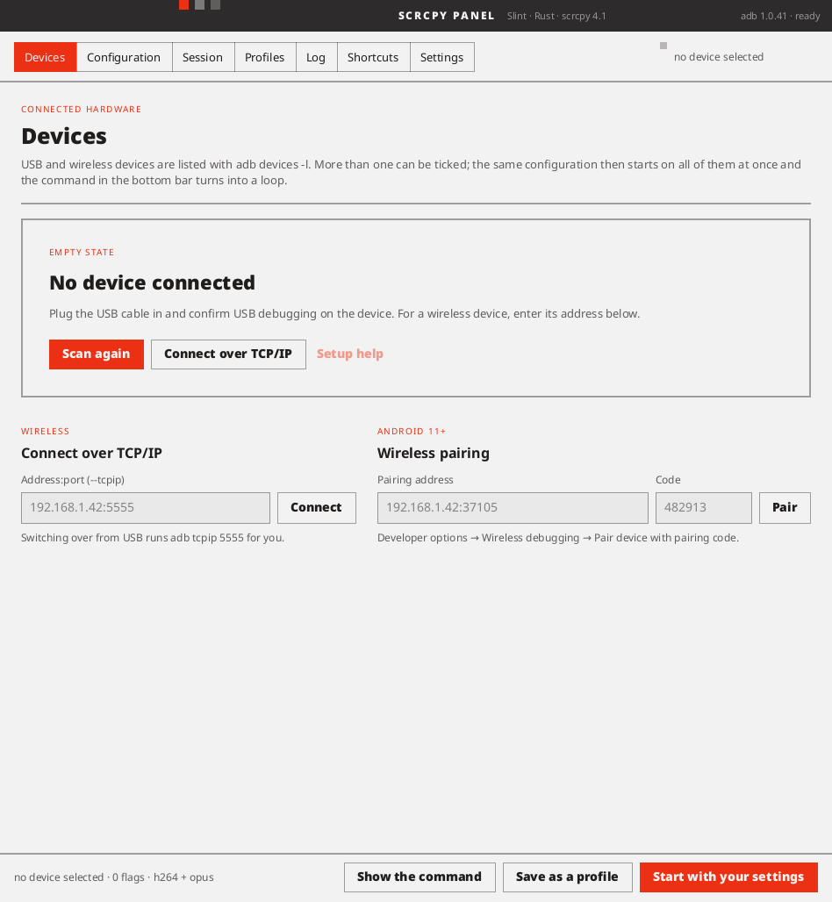
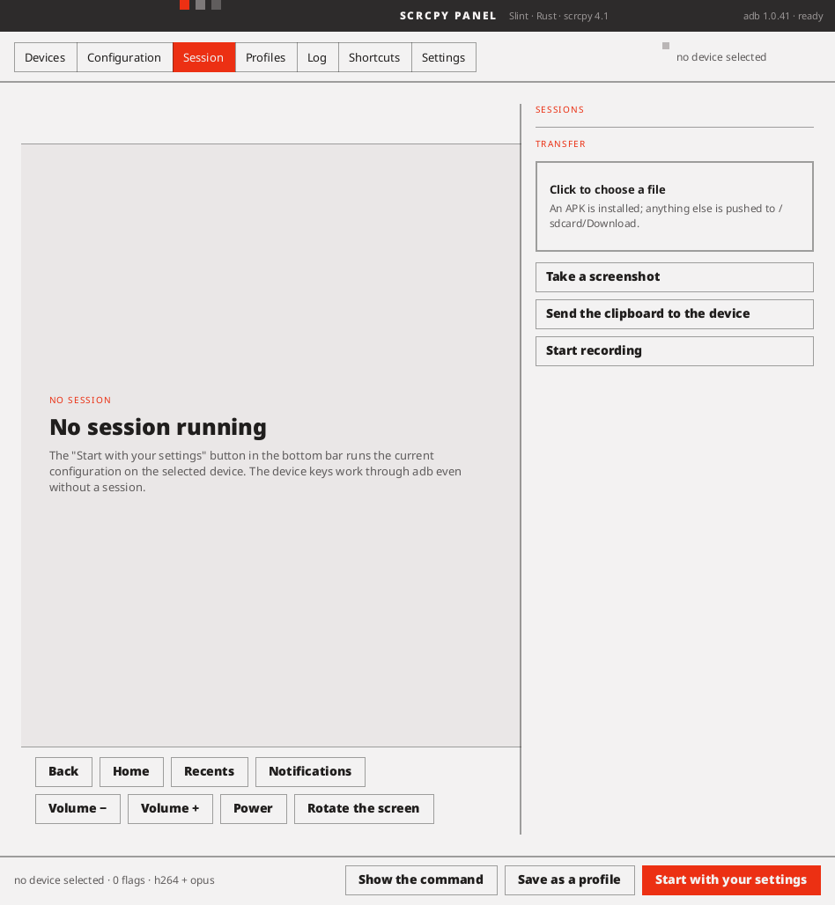
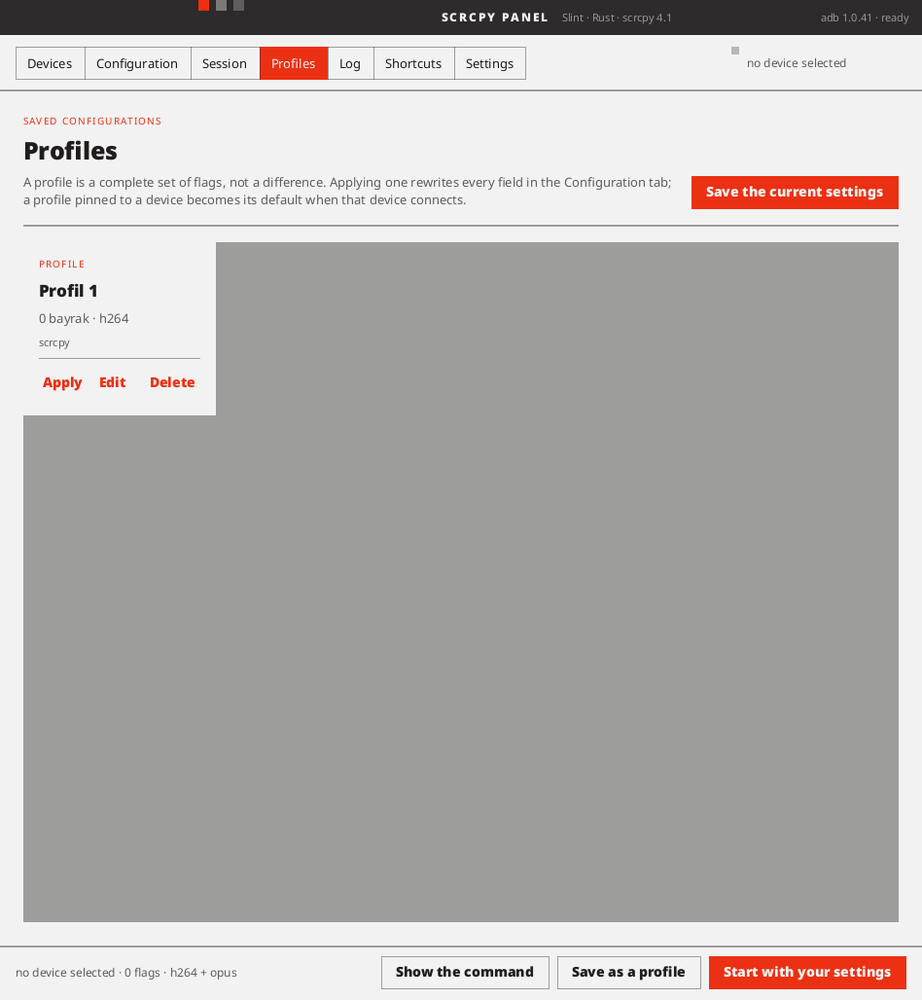
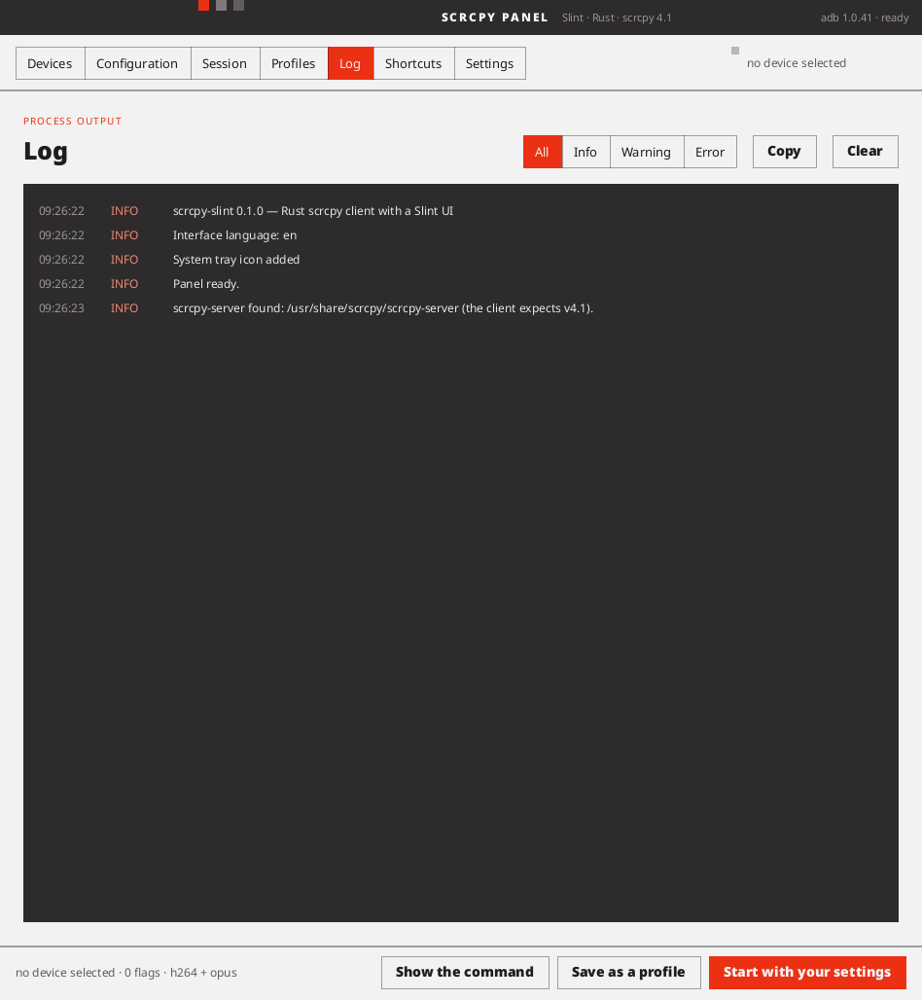

# scrcpy-panel

A Rust scrcpy client with a [Slint](https://slint.dev) user interface — mirror and control
Android devices from a single control panel.

> **Status: 1.0.** `--panel` opens the control panel from [`design/`](./design/) — seven
> tabs, the eight-section configuration form, a live command preview — and the mirror runs
> inside it. `scrcpy-panel` with no flags still mirrors straight into a window of its own.



<table>
<tr>
<td width="50%"><a href="./docs/screenshots/devices.png"></a></td>
<td width="50%"><a href="./docs/screenshots/session.png"></a></td>
</tr>
<tr>
<td><b>Devices</b> — what <code>adb devices -l</code> found, TCP/IP and Android 11+ pairing. Tick more than one and the same configuration starts on all of them.</td>
<td><b>Session</b> — the mirror, the device keys, file push, screenshot and recording. The keys work through adb with no session running.</td>
</tr>
<tr>
<td><a href="./docs/screenshots/profiles.png"></a></td>
<td><a href="./docs/screenshots/log.png"></a></td>
</tr>
<tr>
<td><b>Profiles</b> — a saved set of flags, optionally pinned to a device so it is the default when that phone appears.</td>
<td><b>Log</b> — every record the client writes, filtered by level, and the same lines in <code>panel.log</code> when the setting is on.</td>
</tr>
</table>

<sub>Taken on Linux at the size the panel is given here — 948×1028. It asks for 1200×800 and
the desktop's tiler decides otherwise, which is [a known issue](#known-issues). The six tabs
were photographed from a real window with Slint's own <code>take_snapshot</code> on the
software renderer; the configuration form above them is drawn offscreen at the same size,
because a real window is not 948 wide on this desktop any more.</sub>

## A note on the name

The binary, the crate and this repository are all **`scrcpy-panel`**. It was `scrcpy-slint`
until 1.0 — the name of the fork it grew out of, which is still
[on GitHub](https://github.com/bdrtr/scrcpy-slint) and still holds the lineage back to
upstream. Two things follow from the rename:

- **Nothing you had saved has moved.** Settings, profiles and `panel.log` were written to
  `~/.config/scrcpy-slint/`, and that directory goes on being used while it exists. A fresh
  install writes to `~/.config/scrcpy-panel/` instead. Your files are not this program's to
  relocate while you are not looking. The Ayarlar checkbox that turns the log file on used to
  name the fresh-install path whatever directory was in use, so on the machine this was
  written on it pointed at a directory that does not exist; it reads the path back from the
  same function the writer uses now, so the two cannot disagree.
- **Log lines quoted below still say `scrcpy_slint`** where they were measured before the
  rename. They are left as they were observed rather than rewritten, which is the rule the
  rest of this file is written under; the module prefix today is `scrcpy_panel`.

## What this is

[scrcpy](https://github.com/Genymobile/scrcpy) is split in two: a **server** written in Java
that runs on the Android device, and a **client** written in C that runs on your computer.
The server uses Android framework APIs (`MediaCodec`, `SurfaceControl`, `AudioRecord`) and
cannot be rewritten in Rust — so it stays exactly as it is, unmodified.

This project rewrites the **client** in Rust and puts a Slint control panel in front of it,
instead of scrcpy's SDL window plus command-line flags.

## Provenance

This project started as a fork of
[naaceer-del/ScrcpyRUST](https://github.com/naaceer-del/ScrcpyRUST) (Apache-2.0), a Rust
reimplementation of the scrcpy client. It now lives on its own — the Slint interface, the
4.1 protocol and the control panel are new — but the client skeleton came from there. The
fork it grew out of is kept at
[bdrtr/scrcpy-slint](https://github.com/bdrtr/scrcpy-slint) as the provenance trail. Upstream is a
single-commit repository that has not been touched since it was published, and it ships no
`LICENSE` file — it declares Apache-2.0 in its README and `Cargo.toml` only. This fork adds
the license text and a `NOTICE` recording attribution and changes. See [NOTICE](./NOTICE).

Upstream's own design notes are preserved under [`docs/upstream/`](./docs/upstream/). Treat
their claims with care: the upstream commit message says "100% feature parity", which
6,500 lines of Rust against scrcpy's ~20,000 lines of C does not support.

### What the server actually does

The server is not part of this repository and is not built here: it is
`/usr/share/scrcpy/scrcpy-server` from the distribution's own scrcpy package, unmodified.
That makes several of this client's decisions assumptions about somebody else's code, so
they were checked against the v4.1 server's source rather than left as beliefs:

| The client assumes | The server, in v4.1 |
|---|---|
| Scroll goes on the wire as signed 16-bit fixed point, one notch being `i16::MAX` | `Binary.i16FixedPointToFloat` is `value / 2^15`, with `0x7fff` special-cased to exactly 1.0 — so a bare notch count of 1 arrives as 0.00003, which is what it used to send |
| Injected text is capped at 300 bytes | `ControlMessageReader.INJECT_TEXT_MAX_LENGTH = 300` |
| A string cut to fit must be cut on a character | `DeviceMessageWriter` uses `StringUtils.getUtf8TruncationIndex` for exactly that, in the other direction |
| A device message is at most 256 KiB | `DeviceMessageWriter.MESSAGE_MAX_SIZE = 1 << 18` |
| An audio codec id of 0 means the device could not capture audio | `Streamer.writeDisableStream`: "code 0: it explicitly disables the stream (because it could not capture audio), scrcpy should continue mirroring video only" |

All 23 control message types and all 3 device message types match by name and by id, so
the client covers the 4.1 protocol with nothing missing and nothing invented. v4.1 is also
the newest release upstream has, so there is no version to catch up to.

Everything checked came out in the server's favour: where the two disagreed it was this
client that was wrong, and each of those is now fixed. There is nothing to send upstream.

## Verified

Tested against a Xiaomi Redmi 2209116AG (Android 13) over USB:

| What | Result |
| --- | --- |
| `adb push` + reverse tunnel | works |
| Server handshake, device metadata | works |
| H.264 demux, hardware decode | works — CUDA negotiated automatically |
| Slint window render | works — 25–61 fps at 720p |
| Mirror embedded in the panel | works — live at 1080x2400, correct letterbox |
| Control panel | works — adb detection, device list, command preview, profiles |
| Audio through cpal | works — 48 kHz stereo Opus, no SDL |
| Session metrics | works — resolution, frame rate, codec, rotation, elapsed |
| `--record` | works — 287 frames over 9.72 s from a 30 fps camera source |
| `--new-display` virtual display | works — `New display: 1600x900/240 (id=2)` |
| `--video-source=camera` | works — 1600x1200 at a steady 30 fps |
| `--crop` | works — 1080x2400 cropped to 1080x1200 |
| `--record-format` | works — `mkv` overrides a `.mp4` filename |
| `--new-display` with no value | works — device picks the size |
| Contradictory `--no-audio --require-audio` | rejected with a message |
| `--no-video-playback` | works — 170 frames recorded with nothing drawn |
| `--mouse-bind` | works — parsed, with 6 tests; malformed input warns and keeps the default |
| `--shortcut-mod` | works — scrcpy's `+` and `,` syntax, checked against the phone for all four spellings |
| `--video-bit-rate`, `--audio-bit-rate` | work — scrcpy's K and M suffixes; 2M and 8M measured at 1.51 and 3.37 Mbps |
| `--audio-source` | works — `mic-voice-communication` records 198 Opus frames over 3.93 s; the other ten are the server's own list |
| Ayarlar: adb path, adb port, record dir, screenshot dir | consulted at runtime |
| Ayarlar: autostart profile, version check, log to disk | work |
| Recording started and stopped mid-session | works — 568 video + 552 Opus frames over 11 s |
| Recording with audio | works — this had never worked; every test had used --no-audio |
| `--no-video --record` | works — all four codecs into their own container, 3.99 s each off a silent phone |
| Several devices selected and started together | implemented, needs a second device to try |
| `--max-size`, `--max-fps`, `--time-limit` | work |
| `--list-encoders/-displays/-cameras/-apps` | work |
| `--start-app` | works — server resolves and launches the package |
| `--verbosity` | works — server logs at the requested level |
| `--select-usb` / `--select-tcpip` | work, naming what is connected when nothing matches |
| `--new-display` with `--no-vd-*` | accepted by the server |
| scrcpy 4.1 server handshake | works, no unknown-option warnings |
| Ctrl-C / SIGTERM shutdown | works — pipeline unwinds, no crash |

Tested against a Samsung Galaxy Tab S9 FE (SM-X510, Android 16) over wireless adb:

| What | Result |
| --- | --- |
| `--no-window` | works — 374 frames in 9.05 s through a four-frame channel, recording throughout |
| `--flex-display` | works — the display followed the window three times in one session, 948x492 → 472x492 → 948x492 as a second window came and went |
| `--flex-display` with `--display-orientation 90` | works — the same window asked for 492x948 |
| `--render-fit` | works — the backdrop measured in a screenshot: letterbox 142322 px, stretched 0, unscaled 71618 |
| `--background-color` | works — that backdrop is the colour asked for |
| MOD+t / MOD+Shift+t | works — the server logs the torch going on and off |
| MOD+Up / MOD+Down on a camera | works — the server reports the zoom at 1.0625, then 1.1289, then back |
| MOD+z / MOD+Shift+z | works — frozen, two screenshots differ by 105 RMSE; running, by 573 |
| MOD+Shift+arrows | works — the flips compose, H then V leaving a half turn and no mirror |
| MOD+q | works — a session with `--time-limit 30` ended after 4 s |
| MOD+Shift+r | works — the device encodes again, the stream continues |
| `--pause-on-exit=if-error` | works — waits only on the run that failed |
| Terminal title | works — written into a pty and taken back at the end |
| SCAN_FILE after a push | accepted — a POWER keycode sent straight after it still reached the device, so the control channel survived the message |
| Camera sessions refuse what a camera cannot answer | works — Home, copy, paste and Power sent nothing, and the torch that followed still arrived |
| `--keyboard=uhid` | works — a new input device called "scrcpy" appears in `getevent -pl` while the session runs, and goes when it ends |
| Hardware decoding | works, and is off by default because it is slower here — VAAPI opens on this machine's second render node, which the fixed per-platform list and the node search are for. In a live session on the Redmi, screen busy, it cost 6.49 ms a frame against the software path's 5.40, and 5.43 of that was the trip back from the GPU alone. Its picture is the software decoder's byte for byte — mean 0.0000 of 255, worst single byte 0, over 568 frames |
| `--v4l2-sink`, and the whole path through it | works — with the phone attached and the mirror publishing to a `v4l2loopback` at 1080x2400, a frame read back out with `ffmpeg -f v4l2` matches the phone's own `screencap` to an RMSE of 558 of 65535, 0.85%, and to 576 and 671 on two later runs. The same comparison with the loopback frame's red and blue exchanged is 5306, ten times worse, so the channel order is right rather than lucky. That is the device's screen, encoded on the device, decoded here into RGBA, packed back down to RGB24 and published, all held against what the phone says it was showing |
| Hardware decoding, live rather than against a recording | works — with `--hwaccel auto` the published frame reads 612 of 65535 against the phone's own `screencap` and 5284 with its red and blue exchanged, so VAAPI, the YUV420P the transfer asks the driver for and the conversion after it all put the right picture out in a real session. Until now that was only known from a recording fed through the decoder offline |
| The two decoders agree in a live session too | works — both run against the same still screen and held to the same `screencap`: software 671, hardware 612, and the two published frames 277 against **each other**. The screen itself moved 295 between the two reference shots, so the decoders differ by less than the thing being photographed did — indistinguishable at this resolution, which is what `whether_the_two_decoders_agree` says exactly over a recording |
| The write is chosen again when the stream changes size | works, on the device — with the display changed mid session from 1080x2400 to 720x1600 and back, the log reads `Tail`, then `Direct`, then `Tail` again. 720 is a multiple of sixteen so that converter writes nothing past the row and the direct write is safe there; 1080 is not, so it is not. Nothing was left over from the size before, which is the failure this would have shown |
| A session outliving what it talks to | works — killing the server on the device mid session, and separately killing the local adb daemon, both end in `End of video stream`, an orderly shutdown and exit code 0, within milliseconds. Which matters here more than most places: this machine's phone drops off the bus on its own |
| The wheel | works now, and did not before — the scroll field is 16-bit fixed point and a notch count was being written into it whole, so the device was told to scroll 1/32768 of a step. `cargo test` holds one notch to `i16::MAX` on the wire, and putting the old arithmetic back makes it fail |
| A fourth byte a pixel | works, and is worth 3 ms a frame — a live session on the Redmi with the screen scrolling spent 4.04 ms a draw over 1500 draws before the change and 0.98 over 1520 after, the same probe on the same window. The picture is the same one: RGBA against packed RGB differs by 0.000 of 255 on the two renderers whose snapshots can be trusted, and the hardware decoder, the mirror and `--display-orientation=flipN` all ran clean |
| swscale writing past the window's buffer | fixed — it fills the row out to a multiple of sixteen pixels, which into RGBA is 32 bytes past the last row at 1080x2400 and 28 at 1081x2400, and nothing at all at 1080x2399 where a different converter runs. Which of three writes the client uses is measured on the first frame of each size rather than assumed, and `cargo test` checks the one chosen against a whole-picture conversion at six sizes, byte for byte |
| No copies per frame instead of two | measured at 1080x2400 — 0.70 ms of conversion plus 1.10 of copying became 1.17 ms of conversion and nothing else; the picture still refreshes, two screenshots two seconds apart differing by thousands of RMSE against a still-mirror floor of about 100 |
| `--otg` | works — the device is found on the bus with no adb at all, a keyboard and a mouse are registered over USB, and the pointer's motion comes out of the phone's kernel as `REL_X`/`REL_Y` while the window has it. Its keys and its mouse buttons did **not**, until a review looked: they travel through the window-event path, which turned everything away unless there was a control socket to send it down — and OTG is the one mode that has none. Pointer motion arrives as a *device* event and never passed that gate, which is exactly why this row could be written and the bug still be there |
| `--keyboard=aoa` | works — the AOA keyboard registers over USB during a session and is given back at the end. `cargo test -- --ignored aoa`, with `AOA_SERIAL` set, registers one and types an "a": `KEY_A DOWN`/`UP` came out of the phone's kernel with no adb, no server and no control socket in the way |
| `--mouse=uhid` | works — the device it adds has REL_X, REL_Y and the two wheels; a report of 30,30 came out of the phone's kernel as `REL_X 0x1e`, `REL_Y 0x1e`, and a click as `BTN_MOUSE DOWN`/`UP`. The pointer moving on this desk arrived the same way, 655 relative events in fourteen seconds |

`--keyboard=uhid` was verified in two halves, because nothing here can type into its own
window and be believed. (The mouse needed no such split: the pointer was already moving.) The half above the client: keys pressed in the panel window arrived
at the winit handler as positions — `Code(KeyA)`, `Code(KeyS)`, `Code(KeyD)`, pressed and
released, not synthetic. The half below it, on the Redmi over USB: HID reports for usages
0x08, 0x09 and 0x0A came out of the device's own kernel as `KEY_E`, `KEY_F` and `KEY_G`,
read from `getevent -lt` on the `scrcpy` input device. The join between the two halves —
position to usage id — is the table in `input/winit_keys.rs`, which has tests of its own.

Recording a mostly static screen produces a file shorter than the session, which
is correct rather than a bug: scrcpy's encoder only emits a frame when the
surface changes, so the last timestamp is the last thing that moved.

The mid-stream session header — the one that arrives when the stream changes size — has
now been seen against a real device, three times in one session: `--flex-display` resizes
the device's display while it runs, and each resize came back as a session header with the
client-resized flag set. This paragraph used to say it had only ever been unit-tested.

Every adb call the client makes now goes through one module, `src/adb/device.rs`, and that
move is verified in two halves as well. Reading adb's output is tested against the bytes it
writes — a device list with a mix of `device`, `offline` and `unauthorized` rows, an empty
one, an install that reports `Failure` on stdout and exits zero anyway. Running the commands
is tested against the real adb with nothing plugged in: `cargo test --release -- --ignored
what_adb_says` asks for the list and gets an empty one rather than an error or a phantom
row, reads the version banner back, connects to a closed port and gets an error rather
than a line of news, and queries a device that is not there without hanging. That last pair
found something: `adb connect` exits 0 whether it worked or not — a closed port, an
unroutable address and a name that will not resolve all print a refusal and return success
— so the panel had been showing a failed connect as an ordinary info line and refreshing
the device list underneath it. It reads adb's words now, and the three refusals adb 1.0.41
actually prints are in the test.

The rest of the module has since been put through the same thing, and it caught the same
bug a second time. `tcpip`, `pair`, `install`, `push`, `screencap` and `key_event` are all
run against the real adb with nothing attached now, and every one has to come back as an
error rather than as an empty success. Five did. **`enable_tcpip` could not fail.** It
asked `Command::status().is_ok()`, which answers whether adb *ran* — it does, and then
exits 1 saying "error: no devices/emulators found" — so it slept two seconds on the thread
the panel draws with and reported that a device nobody could see had been switched to
TCP/IP, with adb's complaint going to the terminal where the panel could not show it. It
reads the output now and only waits once the switch has really been asked for; the test
holds the refusal to under a second, since the wait is the tell, and the whole probe runs
in 0.07. The panel says what went wrong instead of discarding it, and carries on to the
connect either way — a device switched over on some earlier day is reachable whether or not
this attempt worked.

Two smaller things came with it. `refused` was looking for a capital F in `Failure` while
`did_not_connect` handed it a lowercased string, so that arm was unreachable down one of
its two paths; nothing adb says about a connect carries `Failure` without also carrying
`error:`, so nothing was getting through the gap, and it is folded and pinned either way
rather than left to that. And the command in that test's own doc comment,
`--ignored --nocapture adb_here`, matches no test — the name is `what_adb_says_here` — so
anyone following the source rather than this file ran nothing at all and saw it pass.

**And then a phone was plugged in, which is the half none of that could reach.**
`what_a_device_says_here` runs the same operations against a device and holds each to what
it should do when it works: the list's row filled in and agreeing with `getprop` and
`wm size`, a screenshot that really is a PNG, a push that lands and can be found afterwards,
a push into `/system` that is refused, an install of something that is not an apk that the
device rejects, a key event, and the wireless switch. It leaves the device as it found it.

Two things came back different from what this file said. **`adb install` does not exit 0 on
a refusal here** — offered a file that is not an apk, adb 1.0.41 exits 1 and says both
"adb: failed to install …" and the device's own "Failure [INSTALL_PARSE_FAILED_NOT_APK …]".
That claim, which is the stated reason `refused` exists, may have been an older adb's; it is
not this one's. What the device does confirm is the same point about **push**: pushed
somewhere read-only it prints "1 file pushed, 0 skipped" *and then* the error, on two
different streams, so a caller reading the first line calls a failure a success. That is
what `last_line` is for and it is now checked against a real refusal.

**And the wireless switch had to be written a third time.** Reading adb's words was still
wrong, because `adb tcpip` tears down the transport it is speaking over in order to do the
thing, and then reports the closure: about half of ten switches came back "error: closed" or
"device not found" for a switch that had worked, one of them with the device's own
`service.adb.tcp.port` already reading 5555. Timed on the Redmi, adb replies at 14 ms, the
transport closes at 67, the device leaves the list at 327, and the property reads 5555 at
878. So the client asks the device rather than adb, and returns the moment it answers —
878, 888 and 997 ms over three runs, against the two seconds it used to sleep blind. Going
back the other way is slower and worth knowing: `adb usb` and the device is answering again
after 5.06 s.

What none of it covers is the protocol side. The push, at least, is no longer among the
untried: it has a fake daemon of its own — sixty lines of `TcpListener` that speaks enough
of adb's protocol to take one — which holds the framing to account rather than skipping to
the end. The transport, the switch to sync mode, the path with its mode, 100 KB arriving as
two chunks because a chunk is 64 KB, the modification time on DONE, the file coming back
byte for byte, and a daemon answering FAIL having its words carried out to the caller.

### The files no review had looked at

Every hunt so far had gone through the same places. This one went through the ones that
had never been read: the pixel maths, the key tables, the pad translation, the audio
decoder, the adb framing, the control queue, the error cards. Seventeen things came back,
and none of them needed a phone to find. What each was held to:

- **Five of the fourteen Android metastate flags were somebody else's flags.** The meta
  row had slipped one slot, so `META_ON` was `META_META_ON | META_META_LEFT_ON` and the
  device was told the *left* Super key was down whichever one had been pressed; the two
  lock flags were `META_CAP_LOCKED` and `META_ALT_LOCKED`, three hex digits away from the
  ones meant. Checked against `android/view/KeyEvent.java` in android-36's
  `android-stubs-src.jar`, and all fourteen are now pinned by a test.
- **And with a phone plugged in, AAC decodes.** The paragraph above proved the fix against
  libavcodec and said the device end was still to do; it is done. A live session against the
  Redmi with `--audio-codec=aac` prints `Audio format: 48000Hz, 2 channels, format:
  F32(Planar)` from `audio_decoder.rs`, and that line is only reached once `receive_frame`
  has returned a frame — so the server's own AAC, not a file, went in and samples came out.
  A broken decoder cannot reach it: `send_packet` fails first, and after fifty in a row the
  warning about refusals is what appears instead.
- **Two things had to be fixed before that session could even be recorded, and both were
  found by trying it.** `--no-video` shut the client down the moment it started: `main.rs`
  took the audio stream, started the pipeline, then found no video and returned, so
  `--no-video --record=out.mkv --time-limit=8` ran for one second and wrote nothing, with an
  INFO line that read like ordinary operation. And the recorder was spawned inside
  `start_video`, so even with the process kept alive there was no thread writing the file —
  the audio packets were teed into a recorder nobody drained. Audio-only sessions run on
  their own loop now, out on the interrupt, the time limit, or the server going away — which
  a session with no picture has to ask about, since it cannot notice the frames stopping.
  The recorder is spawned once the streams have said what they are, with or without a video
  one. The same eight-second run now writes 131 KB of matroska, and `ffprobe` reads back an
  AAC track at 48000 Hz, 2 channels, 8.003 seconds. Video-and-audio recording is unchanged:
  h264 1080x2400 with opus beside it, over 6.16 seconds.
- **Stopping a recording could throw the whole recording away.** The packet loop cannot
  write anything until it knows the PTS origin, so until then each stream holds one packet
  aside and `should_pop` refuses to pop again for a stream that is already holding one —
  the queue being a better place for a packet than the floor. The round on which `stopped`
  arrives was subject to that same refusal, so both locals came back `None` and the loop
  read that pair as "nothing left" and left, dropping the held packet, everything queued
  behind it, and never reaching the `&& !stopped` line four blocks down that exists to
  write out a stream whose partner never came. `stop_recording()` still returned true and
  still logged "Recording stopped". What it takes is a config packet reaching the loop
  first — it is discarded there, which leaves video holding nothing while audio holds one —
  and `start_recording` mid-session makes exactly that, because the `ControlMsg::ResetVideo`
  it sends is what puts a second config packet in the loop's path. Measured on the feed the
  new test uses: three audio packets in and none out, one still held in `pending_a` and two
  still in the queue, and a 626-byte mkv that will not open at all ("End of file"). The
  control says the stop path itself is sound — take the second config packet out of the same
  feed and all three are written, because then nothing is being held when the stop arrives.
  The break now also asks whether anything is still being held; the feed with the config back
  in writes all three. It cannot hold the loop open, because once the origin is known both
  pendings are `None` for good.
  `a_stop_before_the_origin_is_found_still_writes_what_is_held` in `src/media/recorder.rs`.
- **The four audio-only containers were then tried one at a time, and the one that looks
  broken is not.** Four seconds each off the silent Redmi, `--no-video --record` into the
  container `muxer_format_for` picks for that codec: opus into `.opus`, 1035 bytes, 200
  packets; aac into `.m4a`, 65825 bytes, 187 packets; raw into `.wav`, 766030 bytes; flac
  into `.flac`, 8930 bytes, 46 packets. All four decode — 3.99 seconds for three of them,
  and exactly 46 × 4096 samples for the FLAC, which is 3.92 s and one short block. The
  1 KB Opus file is not a truncated one either: it is a silent room at 2 kbit/s, and it
  decodes to the same 3.99 s the 65 KB AAC does. **`ffprobe` reads no duration at all from
  the FLAC**, and its STREAMINFO carries a total-sample count of zero and an all-zero MD5
  where ffmpeg's own encoder writes 191488 and a checksum. That is the container being
  remuxed rather than encoded: hand ffmpeg those very same packets with `-c:a copy` and its
  own muxer writes `N/A` too. The sample count belongs to whoever encoded the stream, and
  that is the phone.
- **The two silences sounded the same, and only one of them had a voice.** A decoder that
  refuses every packet says so after fifty; a decoder that *accepts* every packet and
  returns no frame said nothing, at any level — `decode` gives back `Ok(None)`, which is
  also what a config packet gives back, and the caller cannot tell them apart. That is the
  shape a broken audio path would most likely take next, and it now gets the same fifty-packet
  warning the refusals get. Priming is ordinary and costs a frame or two; the measurement in
  this file is 20 AAC packets in and 19 frames out.
- **And a session now says what it decoded, rather than only that it ended.** `Audio: 237
  frames, 485376 samples decoded` off the Redmi over a five-second AAC run — 237 × 1024
  samples × 2 channels is exactly 485376, and 237 × 1024 / 48000 is 5.056 s, so the count
  agrees with AAC-LC's frame size and with the clock. Getting it *said* took two goes. The
  count was first printed where the pipeline's loop ends, and no ordinary session reaches
  there: the pipeline is a thread nobody joins, so a run stopped by `--time-limit` ends when
  the process does. It is shared with the session now and reported from `shutdown`, which is
  a place that is always reached.
- **The warning about a device sending the wrong format can only ever see one codec of the
  four, and it is not the usual one.** It compares `audio.sample_rate` against 48000, and
  that value is read back off the decoder context — which is where `AudioDecoder::new` wrote
  48000 in the first place. So the question is whether libavcodec ever writes a different
  one back. Put to it with genuine 44.1 kHz content while told 48000, over 40 packets: **AAC
  keeps 48000** and **FLAC corrects itself to 44100**. Opus is 48 kHz by construction and PCM
  carries no rate at all. The check is therefore live for FLAC and a mirror for the rest.
  Nothing is known to send anything else — the server asks Android for 48 kHz stereo and
  Android resamples to it — so this is a guard with one live case rather than a bug, but it
  is worth knowing which case that is.
- **`--audio-codec=aac` had never decoded anything, and `--audio-codec=raw` never
  opened.** The sample rate and channel layout were set only for Opus, and they are the
  only description of the stream a decoder here gets — the config packet is thrown away
  rather than handed over as extradata. Measured against this machine's libavcodec with
  twenty AAC access units out of an mp4: 0 of 20 accepted with the rate unset, 20 of 20
  accepted and 19 frames out with it set. PCM does not even open — `avcodec_open2`
  returns EINVAL for a rate of zero — so raw lost the recording's audio track as well.
  Proved against libavcodec rather than against the server's own stream; the device end
  of that is still to do.
- **The audio ring copied one sample at a time, with a hardware divide on each one.**
  `AudioBuffer::write` and `AudioBuffer::read` both walked an `f32` at a time doing
  `(pos + 1) % self.capacity`, and `capacity` is a field rather than a constant, so LLVM has to
  emit a real `div` — 192,000 of them a second, 96,000 in each direction. They are two
  `copy_from_slice` calls now, split at the wrap, with a conditional subtract to come round.
  **The CPU is not the point and should not be sold as one:** 0.448 ms per second of audio
  became 0.007, which is 0.045% of a core going to 0.0007%, and that is lost in the noise of
  everything else here. What earns the change is the lock. Both run inside the `Mutex` the cpal
  callback also takes, and that callback is the real-time thread `player.rs` opens by saying
  must not be made to wait: a push held it 4.7 µs and now holds it 0.08, a pull 1.1 µs and now
  0.04. At 50 pushes and 200 callbacks a second, a callback landing on a held lock goes from
  about once every twenty seconds to about once every twenty minutes. It is a glitch-risk
  change. Measured with a standalone `rustc -O` bench at the real geometry — capacity
  `(2400 + 48000) × 2`, 50 pushes of 1920 and 200 pulls of 480 a simulated second — alternating
  the two implementations to rule out ordering: 8.95 and 8.97 µs a push-cycle against 0.15 and
  0.15, repeating to two decimal places. `objdump` confirms the `div` in the old loop body.
  Two tests came with it, because a loop with a `%` on every sample cannot get the wrap wrong
  and two copies can: one drives the ring two hundred rounds against a `VecDeque` at a capacity
  coprime with both the read and write sizes, and one puts a write exactly on the end of the
  buffer. Each catches a sabotage the other misses — `>` for `>=` fails only the boundary one,
  and a tail copy shifted by one fails only the model one, on round 7.
- **And the logger built a line for a listener that could never exist.** The fan-out turned
  every record into an owned `Line` — two `String`s — before asking whether anything was
  listening, so a plain mirror run, which has no window and never installs a sink, paid for
  five hundred of them into a backlog nobody would collect and then went on allocating and
  dropping one per record after that. `init` is now told from the same command line whether a
  window may ever want them. Small at `info`, where a run is a dozen lines; the case it is for
  is `--verbosity=verbose`, where slint's and winit's own `trace` output arrives too.
- **Three more silences, one flood, and a line that was never a log line at all.**
  - **A video decoder that takes packets and gives nothing back said nothing, at any level.**
    `receive_frame(..).is_ok()` collapses EAGAIN — "send me more", which is ordinary between
    frames — and every real error into the same `false`; `decode_into` returns `Ok(false)` and
    the pipeline files that under "no frame this time" and loops. So hardware decode failing
    per frame, or a stream whose first keyframe was missed, looked exactly like an idle phone:
    the window holds its last picture, the panel reads 0.0 fps, and the last video line in the
    log is the launch banner. The audio decoder has had this measurement for a while —
    `accepted_without_a_frame`, warning once past fifty — and the video side now has the same
    one, with the same fifty and for the same reason: priming costs a frame or two and fifty is
    not priming. An error that is not EAGAIN is also logged rather than folded into the same
    `false`.
  - **A failing V4L2 sink warned once per frame, for ever.** A consumer that closes the node
    makes every write fail, and at 60 fps that is sixty identical lines a second for as long as
    the session runs — which drowns whatever else the log had to say, and, now that records
    reach the panel, would be sixty rows a second in the Log tab. The first failure is the
    warning; the rest are counted, and one line says so when writes start working again.
  - **And the last thing a failed run said was the one line in the program with no level and no
    timestamp.** `main` returning `Err` is printed by Rust's own `Termination` as `Error: ...`,
    which never goes near the log — so the single most important line of a failed run reached
    no file, no panel, and nothing reading levels. It goes out the same door as everything else
    now, and the process still leaves with the code it would have: the `--otg` refusal measured
    above still exits 1, and reads
    `[2026-08-23T06:47:10.479Z ERROR scrcpy_slint] --otg opened neither a keyboard nor a mouse…`
- **The recorder threw away every write result, then announced the file as complete.**
  `av_interleaved_write_frame` had its verdict dropped at all three call sites and so did
  `av_write_trailer`, so `open_and_record` returned `Ok` whatever the filesystem had done. The
  session then logged "Recording complete: {path}", and the panel — whose `stop_recording`
  returned a `bool` meaning only "there was one" — said "Kayıt durduruldu, dosya kapatıldı."
  Both over a file with nothing in it. libav reports these rather than logging them, and the
  recorder's `av_log_set_level(AV_LOG_WARNING)` would not have surfaced them anyway: an ENOSPC
  was a number nobody looked at. The verdict is kept now and the first refusal ends the
  recording, which is what scrcpy does too — a muxer that has started saying no is not going to
  be talked round. The trailer is still attempted, because a partial file a player can open
  beats one it cannot. `av_strerror` is asked for the words. The result travels back out of the
  recorder's thread instead of being swallowed there, `stop_recording` answers with three cases
  rather than a bool, and the panel says what happened; the five-second wait is *not* counted as
  a failure, since nothing knows yet at that point and a wrong claim in that direction is as
  wrong as the old unconditional success. Tested against `/dev/full`, which is a full disk that
  needs no root, no partition and no device — every write to it returns ENOSPC — and the
  assertion is narrow on purpose: it demands the message come from a packet write or the
  trailer, *and* carry libav's own "No space left on device", so that the header check which has
  always existed cannot pass it by accident.
- **What the phone said went to stdout, and what adb said went nowhere.** Three silences in
  the same place — the layer where somebody else's words arrive — and each was found by asking
  what a user would have to read to know why a session failed.
  - **The server's own log was a `println!`.** `[server] {line}` on stdout: no level, no
    timestamp, nothing `RUST_LOG` or `--verbosity` could turn down, and — never having gone
    near the log crate — nothing the panel's Log tab or `panel.log` could ever show. It was
    the one line of the measured session above that reached the terminal and not the file. The
    device puts its level in the text (`Ln` writes `INFO: Device: [Xiaomi] Redmi 2209116AG`),
    so the token is taken off and becomes the record's level: the panel's "Hata" filter finds
    a server error now, and `--verbosity=warn` drops the chatter without dropping the
    failures. Its stack traces keep their text and come through at info, because guessing an
    error out of an indented Java frame would file half a trace under one level and half under
    another. Nine real lines off the Redmi are the test.
  - **The server process ending was logged nowhere at all.** The reader thread simply ran out
    of lines. In reverse mode a server that dies on its parameters never opens a socket, so
    the client polled an accept for the full thirty seconds and then blamed the socket. The end
    of the shell now says so, with the last thing the server managed to say, and the accept
    loop asks whether the server has gone rather than waiting out a clock for an answer that
    will not change.
  - **adb's reason for refusing a tunnel was dropped seventeen times over.** Both loops had
    `Err(_) => continue`, so a device that fell off the bus between the push and the tunnel —
    one reason, every port — came out as "Could not set up reverse tunnel on ports
    27183..27199", which `failure::classify` matches on "tunnel on ports" and answers with
    "Port kullanımda" and a button offering to restart adb. The ports were never it. The first
    refusal is kept now, and **the classifier needed no new rule**: the offline card has
    matched `device '...' not found` all along and simply never saw one.
  - **And the test written for that found the reason was empty even so.** Run against the real
    adb with nothing attached — `cargo test --release -- --ignored what_adb_says_when_it_refuses`
    — the message came back `(adb said: ADB error: )`. Not a bug in the protocol reader but in
    the question: measured against adb 37.0.0, `host-serial:<serial>:forward:...` answers
    `FAIL` and then a length of `0000`, while `host:transport:<serial>` answers `FAIL` and then
    `001f` followed by `device 'nosuchdevice' not found`. adb's own CLI has the sentence
    because it transports first. So `forward` asks the transport when its own refusal comes
    back empty-handed, and a `FAIL` with no reason at all no longer prints as `ADB error:` with
    nothing after it. The end of it, with no device on the desk:
    `Could not set up forward tunnel on ports 27183..27186 (adb said: ADB error: device
    'nosuchdevice' not found)` — which is the string
    `real_messages_land_on_the_card_that_names_them` now holds, landing on the offline card.
- **`--verbosity` turned up the phone and left the client where it was, and any word at all
  got through it.** The flag was documented as "Server log level", forwarded to the server as
  `log_level=` and read by nothing else; the client's own level came from `RUST_LOG` and only
  from `RUST_LOG`. scrcpy has one flag for both halves, which is what `-V, --verbosity=value`
  means in its own help. And it had no `value_parser`, so it was the same fault as
  `--audio-source` one flag along: put `--verbosity=nonsense` to the Redmi and the server threw
  `IllegalArgumentException: No enum constant com.genymobile.scrcpy.util.Ln.Level.NONSENSE`,
  which reached the user as `Failed to connect to server: Timeout waiting for server
  connection` — thirty seconds of nothing, then a network error for a typo. It is now checked
  at the command line and refused in one line with the five it accepts, exiting 2. The five are
  the server's, read off `Ln.Level` in the jar's own `classes.dex` rather than remembered:
  `verbose`, `debug`, `info`, `warn`, `error`. The panel offered four of them — `verbose` was
  missing, though the server has always taken it — so the picker now offers all five and the
  field is no longer labelled as the server's alone. Measured with no device needed, counting
  the client's own lines out of `--panel`: `info` gives 6 lines with no DEBUG and no TRACE,
  `debug` gives 26 with 20 DEBUG, and `verbose` gives 108 with 20 DEBUG and 82 TRACE — the
  server's `verbose` is Rust's `trace`, which is the only one of the five whose name differs
  between the two sides. `RUST_LOG` still wins where it is set, because `from_env` reads it
  first: `RUST_LOG=warn --verbosity=verbose` gives 1 line, not 108. One thing the flag cannot
  do is retune a process already running — the panel's own level is set by the panel's command
  line, and the form's value is what reaches the server and a windowed session's child.
  `every_value_the_panel_offers_is_one_the_binary_takes` covers this picker now purely because
  the flag gained a `value_parser`: putting `chatty` in the list fails it with clap's own
  "[possible values: verbose, debug, info, warn, error]".
- **The panel's log did not have the session in it, and the file its checkbox names had
  even less.** There was no `log::Log` implementation in the program at all: `env_logger` went
  straight onto the terminal, and the panel kept a second, unrelated log of its own. So a line
  went to one place or the other and never to both. Everything in `session/`, `media/`,
  `control/` and `adb/` reached stderr and nothing else — which for a panel started from a
  desktop launcher or from the tray is a stream nobody is reading — while the tab headed
  "Süreç çıktısı" and `panel.log` held only the lines the panel writes
  by hand. Worse, the two writers into that tab were not the same writer: `append_log`, which
  carries a windowed session's output, wrote into the model directly and never touched the
  file, so the checkbox could be ticked and the file still not contain what the tab was
  showing. Measured on the Redmi with the settings this machine actually has
  (`mirror_mode: embedded`, `log_to_disk: true`), copied into a config directory of its own so
  nothing real was touched: a `--panel --start` session put **26 lines on the terminal, 24 of
  them from `scrcpy_slint::` modules, and 6 lines in `panel.log` — none of them among the 24**.
  Which device, which server jar, which tunnel port, which codec, which decoder: all of it on
  a stream the panel's own user cannot see. The same run now writes **25 lines and a run
  boundary**, the terminal is unchanged at 26 and byte-for-byte the same format, and every line
  in the file carries a full date where it used to carry a bare time of day — appended to
  across three days, it used to read as one long session. The one line still on the terminal
  and not in the file is `[server] INFO: Device: [Xiaomi] Redmi 2209116AG (Android 13)`, which
  is the device's own log printed with `println!` and never offered to the log crate at all.
  `src/logging.rs` is the one logger; the panel installs a channel on it with `listen()` and
  drains it on a timer, because the decoder, the recorder and the demuxer all log from threads
  of their own and a Slint model belongs to the event loop. Two edges needed measuring rather
  than assuming. Lines written before a window exists are held and handed over in order, so the
  log starts where the process does rather than where the window does — six lines, on this run.
  And the drain timer stops when the event loop does, so the last lines of a run went to the
  terminal and died in the channel; there is one more drain after the loop returns. That was
  four lines, and they were the four that say how the session ended: `Interrupted`, the audio
  frame total, `End of video stream`, `Oturum durduruldu.` Three tests: the date arithmetic
  against six known instants including two leap-day edges, the level-name mapping, and a record
  actually coming back out of the second sink — the held one first, the live one second.
- **"Düzenle" pointed the next launch at a phone nobody had ticked.** `Cfg.serial` is
  written from two directions — the Devices tab ticks rows into it, and the configuration
  form has a field of its own — and `read_config` copies that field into every profile
  saved, so a profile quietly carries whichever device was plugged in the day it was
  written. `write_config` puts it back unconditionally. "Uygula" knew this and restored the
  tick afterwards, with a comment saying the ticked rows are the authority; "Düzenle" and
  "Varsayılanlara dön" did not, so pressing either left the Devices tab showing B ticked,
  the label saying B and the count saying one, while the command bar and the next "Başlat"
  went to A. Nothing resyncs it: the device list is refreshed by the Yenile button and by
  the connect and pair paths, never on a timer. All three go through one helper now.
  There is no window in a unit test, so the invariant is tested where it lives — every
  `write_config` call site has to settle the serial within a few lines, by the helper or, for
  autostart, by the explicit `set_serial` whose whole subject is the device that has just
  appeared. Run against the source as it was before this commit, the same rule flags
  `wiring.rs:74` and `wiring.rs:467` and passes `wiring.rs:417`, which is exactly the two
  buttons that were wrong and the one that was right.
- **The panel showed the wrong card for four of its own failures.** Run against the old
  classifier, on messages this program really produces: a missing `scrcpy-server` came
  out as "adb bulunamadı" with a file picker for the adb that had just worked, two
  phones plugged in
  came out as "Cihaz bulunamadı" with advice to plug one in, the `--require-audio` and
  `--no-audio` refusal came out as a warning saying audio needs Android 11, and port
  exhaustion — the one failure the port card exists for — fell through to the generic
  card, because the card's phrases were upstream C scrcpy's rather than this client's.
- **`--shortcut-mod=lalt,lsuper` is the line scrcpy prints in its own help, and this client
  warned at it and did something else.** Found by reading the first line of an ordinary run:
  `Unknown shortcut mod 'lalt,lsuper', defaulting to lalt`. scrcpy's `--shortcut-mod` is a
  list rather than a key — alternatives separated by `,`, each one or more keys joined by
  `+`, so `lctrl+lalt,lsuper` means both together or Super on its own — and only a single
  token parsed here. Everything else fell through one arm to lalt, which is a command line
  that runs and quietly means something else. It parses the documented syntax now, and the
  four spellings were put to the real binary against the Redmi rather than to the tests
  alone: `lalt,lsuper` and `lctrl+lalt` warn about nothing, `lhyper,lsuper` drops the
  alternative it cannot read and keeps `lsuper`, and `nonsense` says so twice and falls back.
  Left and right stay one flag, which is Slint's limit rather than the parse's, and the
  default here stays `lalt` where scrcpy's is `lalt,lsuper` — a difference worth knowing
  about rather than one to change quietly.
- **The command line the panel prints for copying did not run on the binary that printed
  it.** `command/mod.rs` opens by saying the preview is "canonical scrcpy flags, so it can be
  copied into a terminal" — and `--video-bit-rate=8M`, which is the form scrcpy's own help
  prints, came back from this client's argument parser as `invalid digit found in string`.
  The panel had been getting away with it: `expand_bit_rate` turns 8M into 8000000 behind
  the preview's back before launching, and a test named
  `bit_rates_are_expanded_for_the_client_but_not_for_the_preview` pins exactly that
  asymmetry. So the one path that never went through the panel — a human copying the line
  the panel offers — was the one that failed. `--video-bit-rate` and `--audio-bit-rate` take
  the suffix now, in either case, and refuse `8G`, `eight` and `9999M` with a sentence rather
  than folding them into a plausible small number. Put to the Redmi under the same motion,
  the suffix reaches the phone's encoder and changes what comes back: `2M` records 1.51 Mbps
  and `8M` records 3.37 Mbps over about seven seconds each. The 8M run is under its ceiling
  because the picture did not need the bits, which is what a cap is. The panel still expands
  before launching; that is belt and braces now rather than the thing holding it up.
  The test had been asserting on upstream's wording under a comment saying these are
  messages "this program or adb really produces".
- **`--no-control` took the window's own shortcuts away with the device's.** Every callback
  on the `Mirror` global — the two keyboard ones, the four pointer ones and the double click
  on the letterbox bars — was registered inside `wire_input`, and `attach` called `wire_input`
  from inside `if let Some(controller) = controller`. So a session started with `--no-control`,
  which is handed a `None` controller all the way down from `connect_sockets`, registered none
  of them: not the shortcuts `attach` answers itself (rotate, flip, pause, the frame counter),
  and not the ones it forwards to the host (fullscreen, quit, resize-to-fit, pixel-perfect).
  `grep` settles the "before" with nothing attached — `wire_input` had exactly one call site
  and it was that `if let`, and `on_key_down`, `on_key_up` and `on_borders_double_clicked`
  appear in no other file. The keystroke was not even falling through to the desktop, because
  `ui/mirror_view.slint`'s FocusScope ends its `key-pressed` with `return EventResult.accept`.
  scrcpy has never worked that way: `sc_input_manager_process_key` runs its whole `if (smod)`
  block *above* `if (!control) return;`, precisely so read-only mirroring keeps its window
  keys. The controller is now an `Option` the whole length of that path — `key_down`, `key_up`
  and `run_shortcut` — and the line where it stops being optional is the same line scrcpy
  draws it on, below the shortcut block. The four pointer callbacks are still wired only with
  a controller behind them, because every one of them ends in a message to the device.
  `window_only` is exhaustive over `ShortcutAction` rather than wildcarded, so a shortcut
  added later cannot slip through as the wrong half. Two tests: the window's eleven still
  answer with no channel at all, and the device's four still reach the device when there is
  one — which is what says the fix did not move the device's half into the window's.
- **And the panel offered an audio source the server has never had.** Section 02's picker
  listed `voice-communication`. scrcpy 4.1 has eleven audio sources and that is not one of
  them — the real name is `mic-voice-communication` — and nothing between the picker and the
  phone said so, because the panel only checks flag *names* against `SUPPORTED` and
  `--audio-source` was a bare `Option<String>` with no `value_parser` while thirteen of its
  neighbours in the same file have one. Put to the Redmi, the string went the whole way:
  the server threw `IllegalArgumentException: Audio source voice-communication not
  supported` at `Options.parse(Options.java:385)`, and what reached the user was four lines
  of Java followed by `Failed to connect to server: Timeout waiting for server connection`.
  The correct name on the same phone records: `--no-video --audio-source=mic-voice-communication
  --record` gives 198 Opus frames, 380160 samples, 3.93 s, 62 KB. The eleven are now a
  `value_parser`, read off the server rather than remembered — `strings` on the
  `classes.dex` inside `/usr/share/scrcpy/scrcpy-server` has exactly them, and
  `scrcpy --audio-source=<anything else>` prints the same list back — and the picker offers
  all eleven instead of six-and-a-mistake.
- **The test that would have caught it now asks the question of every picker.** `--video-bit-rate=8M`
  and `voice-communication` are the same fault twice: a value the panel offers that the
  binary refuses. `every_value_the_panel_offers_is_one_the_binary_takes` reads the eight
  `ui/config/section*.slint` files at compile time, pulls each `Sel`'s values — falling back
  to its labels the way `Sel` itself does when there are no values, which is how
  `--video-codec` is written — and pushes each one through `to_client_args` into
  `Options::try_parse_from`. Through `to_client_args` rather than around it, so a value that
  needs translating on the way (`toDevice` becomes `to-device`, `8M` becomes `8000000`) is
  tested through its translation. Forty-plus values, and it counts them so that a scan which
  quietly stopped finding pickers fails rather than passes. Reverting only the one-word
  picker fix makes it fail with the offending value, the flag the panel built, and clap's
  own "a similar value exists: 'mic-voice-communication'".
- **The control queue would throw away the finger coming up.** `QUEUE_LIMIT` is
  documented as the limit "for droppable control messages" and nothing in the code knew
  which those were: sixty touches is one drag, and the release that ends it went over the
  side as readily as a move, leaving the device believing the finger was still down. Moves
  and scroll notches give way now; everything else waits a quarter of a second for room,
  and a channel that has actually died comes straight back rather than waiting.
- **One daemon listed the devices while another one mirrored them.** An explicit adb
  port of 5037 — which is what the panel's own field says out of the box — was left off
  the children on the grounds that it is adb's default, which is true only when
  `ANDROID_ADB_SERVER_PORT` is absent from this process's environment. It is inherited.
- **The server's log stopped after five quiet minutes.** The shell stream carried a
  five-minute read timeout, which is a deadline on a quiet shell rather than a slow one,
  and the reader read the timeout as end of stream. Everything the server printed
  afterwards went nowhere.
- **Thirty translations were one `msgcat` away from vanishing.** build.rs read only the
  first line of a `.po` entry, and a wrapped entry — what msgfmt, msgmerge and xgettext
  write for anything past the seventy-ninth column, and 28 of these msgids are longer
  than that — was dropped whole and silent. Running the file through `msgcat` took the
  table from 397 entries to 367. Three messages had drifted out of the file as well and
  were showing in Turkish in an English panel; a test now walks the Rust source for
  `tr!` calls and holds every one to the generated table, and a second walks the error
  cards, whose strings reach `tr!` as variables and are invisible to the first.
- **`--video-buffer` smooths the stream now, and it did not before.** It used to release a
  frame at the moment it *arrived* plus a constant, so the spacing on the way out reproduced
  the spacing on the way in exactly — three frames arriving in a 2 ms burst left as a 2 ms
  burst N ms later. That is a shift, not a smoothing, and the difference is the whole reason
  the option exists. A frame is released on its own timestamp now, which is what the device
  recorded and therefore what the screen actually had. `DecodedFrame` carries the timestamp
  (`src/media/clock.rs` is upstream's `sc_clock`, ported: an additive offset averaged over
  thirty-two points with a startup ramp, and the same truncating division, because the offset
  is negative and a shift would floor it). Three of upstream's precautions came with it: the
  deadline is re-derived on every wake rather than fixed at push, since each new frame
  improves the offset; it is clamped to `now + delay` from the moment the frame was picked
  up, without which a timestamp discontinuity — a rotation, a stream reset — freezes the
  window for exactly the size of the jump; and a frame past its deadline is released rather
  than dropped, because this buffer has no way to hand one back to the frame pool and a pool
  that can only shrink leaves the decoder allocating ten megabytes a frame for the rest of
  the session. A stream that arrives without timestamps keeps the old behaviour rather than
  losing the buffer.

  `a_burst_leaves_spread_out_again` is the test, and it has teeth: three frames pushed
  together but stamped 60 ms apart have to leave at least 80 ms apart, and put back on
  arrival scheduling for one run it fails. The bound is a lower one on purpose — a loaded
  machine can only make the gaps longer.
- **It was written wrong first, and only the device said so.** The deadline is
  `to_system_time(pts) + delay`; the first version read the *arrival* the timestamp implies,
  found it already in the past — which by the time a frame is popped it always is — and took
  that as overdue, falling through to the ceiling. Every frame then waited the whole delay:
  the buffer throttled the stream to one frame per `--video-buffer`. On the Redmi with the
  screen scrolling that was **5.0 fps against 37 without the buffer**, flat; after the fix,
  66.5 to 69.3. The burst test could not see it, because pushing everything at once makes the
  two arithmetics agree. `a_steady_rate_comes_out_at_that_rate` is the one that would have:
  five frames 30 ms apart behind a 200 ms buffer, which must all be out inside 600 ms and
  would take 1000 one-per-delay.
- What the device could **not** show is the smoothing itself. Run back to back with the
  screen scrolling, `--print-fps` reads 66.8 mean against 69.6 with the buffer, standard
  deviation 9.3 against 10.2 — indistinguishable, and it should be: frames counted per second
  say nothing about their spacing *within* the second, which is the only thing this changes.
  The regression it did catch is what a live run is for; the smoothing rests on the tests.

  The first frame does not wait. There is nothing yet for it to be smoothed against, and
  holding it would mean `--video-buffer=200` costing a fifth of a second of black before the
  session appeared. It is upstream's `first_frame_asap`, which both of upstream's own call
  sites pass, and it fires exactly once — on the push that sets the clock, and only while
  nothing is queued ahead of it.

  What this cannot reach is downstream. The window's pump polls on a 4 ms timer and draws the
  newest frame it finds, so releases are re-quantised to 4 ms whatever the buffer does: a
  fifth of a frame at 16.7 ms, and the floor on what smoothing here is worth. Its stop is prompt now as well — it waited in a `sleep` no notification
  could cut short, so a buffer told to stop held its thread, and the join behind it, for
  the rest of the delay: with the sleep put back, the new test measures the join waiting
  2.95 s of a 3 s delay for a buffer that had been told to go.
- **The UHID gamepad introduced itself as nothing in particular.** Vendor and product
  zero, where upstream sends the Xbox 360's — which is what makes Android load a key
  layout that puts the triggers and the right stick where a game looks for them. And an
  analog trigger arriving as an axis was read as though it were 0..1, where every gilrs
  axis is -1..1, so the first half of the pull did nothing. Still the one thing here with
  no pad to try it on: both are read off gilrs's source and upstream's, not off a device.

Two tests were also racing each other rather than testing anything: `cargo test --release
adb::settings` failed 5 runs in 60, because two tests wrote the same process-wide setting
in parallel and a third read it. They take turns now — 60 runs, none failed.


## Known issues

- **The panel is given its width rather than choosing it, and one row used to overlap when
  that width was small.** `ui/panel.slint` declares `preferred-width: 1200px` on the
  `PanelWindow` and the window opened at 948×1028 when the screenshots above were taken. That
  number is not Slint's. COSMIC's auto-tiler is on here — `autotile` is `true` in
  `~/.config/cosmic/com.system76.CosmicComp/v1/` — so the window is handed whatever the tile
  is, and the tile depends on what else is on the workspace: the same binary was given
  468×492 on a later day. The height settles the origin on its own. A Slint window's size is
  `preferred.min(max).max(min)` over what it declares, and this one declares 800 with no
  maximum anywhere in `ui/`, so Slint can never ask for 1028 — and width and height arrive in
  the same xdg configure. `set_size` does not help, and there is now a line to point at
  rather than an observation: winit's Wayland backend takes the compositor's configure
  verbatim and turns its own constraining off with it, and `i-slint-backend-winit`'s
  `resize_event` writes that size over whatever `set_size` optimistically reported, which is
  exactly "it reports the new size and then goes back". **An earlier version of this entry
  blamed the layout inside the window, and that was wrong**: the compiler *replaces* the
  child layout's preferred and minimum widths with the `Window`'s own, so 1200 does win
  inside Slint and is then thrown away outside it.
- **The overlap was real, and it was nothing to do with the window's size.** It happens at
  any width where the row is short of space. `Grp` is a `GridLayout`, and one short of space
  takes the shortfall out of the cells that can give it: the two `Seg`s and the `Btn` in the
  Video section's first row — the only row in the panel with four cells — have minimums equal
  to their own text, so all of the shortfall lands on the encoder field, which had no minimum
  at all. At 948 that leaves the field 51px wide holding a 152px placeholder, and a
  `Rectangle` in Slint does not clip its children, so `c2.android.avc.encoder` was painted
  112px past its own border: 71 inked pixels filling all sixteen columns of the gutter, under
  a button drawn after it. The placeholder was the one `Text` in `ui/components.slint` left
  free to be as wide as it liked — the `TextInput` four lines below it, the field label above
  it and the dropdown beside it were all bounded already. It elides now, and
  `the_encoder_field_keeps_its_placeholder_to_itself` measures the gutter rather than
  describing it — at the size the compositor gave the window, the size the panel asks for,
  and the smallest it says it supports. 16px of clear page at all three; against the tree
  before the fix it fails by name: *at 948x1028 the encoder field's placeholder is drawn
  outside it: its border is at x=616 and x=617 is inked as well.*
- **And the form spread itself over whatever height it was given.** The same picture showed
  it and it took a moment to see: at 1028 tall, "Bit rate · --video-bit-rate" sat 92px above
  the box it names, because the slack between the form's natural height and the window's went
  into the `GridLayout`'s rows and then into each `Fld` between its label and its control. A
  section is a stack of rows at their own height rather than something to spread over a
  window, so the configuration body is `alignment: start` now and the slack stays at the
  bottom where it belongs. Nothing moves at 1200x800, where the form fills the height already.
  The Settings tab had the same fault and took the same line, found later by the same sweep:
  its three groups are layouts too, and at 1028 tall "adb executable" sat 170px above the box
  it names. The other five scroll bodies were checked rather than assumed and do not need it
  — the log's lines and the shortcut table render pixel for pixel the same with the property
  and without it, so they have not been given it.
- **And the row that overlapped was a four-cell row in a three-column grid.** Bounding the
  placeholder stopped anything being drawn over anything else; it did not give the encoder
  field any room. At 948 that field was 51px wide, 49 of it fill — `Grp` is a `GridLayout`,
  one short of space takes it from the cells that can give, and the two `Seg`s and the button
  all have a minimum equal to their own text, so the whole shortfall landed on the one cell
  with no minimum at all. A `GridLayout`'s columns are shared down the whole grid, so that
  squeezed the third column of every row in the section rather than only the first: at 900 it
  was a ten-pixel sliver in all three.
  The mockup settles what to do about it. `.grp` is `grid-template-columns: repeat(3, 1fr)`,
  and section 01's group there has nine fields in it and no button at all — `--list-encoders`
  is named in the section's own description and nowhere else. The four-cell row is this
  port's addition, so the button now sits under the field it fills in rather than beside it.
  The encoder field went from 51px to 311 at 948, 295 at 900 and 395 at 1200, and
  `the_encoder_field_has_room_and_keeps_its_placeholder_to_itself` measures it rather than
  taking anyone's word: against the four-cell row it fails with *at 948x1028 the encoder
  field is 49px wide, which is not enough of an encoder name to read*. The same test then
  walks the other seven sections at 900 and checks that none of their fields is drawn past
  its own border either.
  A `Fld` packs to the top now as well. A label belongs directly above its control, and
  without that a field sharing a grid row with a taller cell — which is exactly what the
  encoder field's cell became — spreads its two children over the whole row and leaves the
  label floating away from the thing it names.
- **What is still true is that the panel is drawn for 1200 and given less.** At 900 the form
  fits, with a scrollbar down the side for the height. Below 900 — the width the panel itself
  declares as the least it supports — there is no horizontal scrolling in the configuration
  body and the right of the form is simply cut off; at the 468 COSMIC hands it with four
  windows on a workspace that is most of it. The reason is worth knowing, because the
  Devices table's own scroller works: a `Flickable`'s viewport is `max(its own width, the
  minimum width of its layout children)`, but the eight sections are `if App.section == "…"`,
  a conditional child is a repeater, and `passes/flickable.rs` folds that layout info over
  `.filter(|x| x.borrow().repeated.is_none())` — with a FIXME naming slint#407. So the body's
  minimum width is zero whatever is in it, and there is nothing for the viewport to widen to.
  Giving it a number of its own is possible and is not done: the number is the widest row in
  whichever language is showing, and a stale constant would put a scrollbar under a form that
  fits. `the_form_is_cut_off_below_its_minimum_and_still_overdraws_nothing` photographs it at
  700 and 468 and checks the part that has to hold anyway — cut off or not, nothing is drawn
  on top of anything else. Section 05's two longest checkbox labels still
  elide by a few pixels. `min-width: 900px` is a promise the content can now keep, but in
  Slint it replaces the layout's own minimum rather than raising it, so it is the only
  minimum the panel ever states.
- **The failure card and a running session had never been seen, and both hold up.** Two
  states the panel spends real time in cannot be reached without a phone, so nobody had
  looked at either: the card `src/panel/failure.rs` builds when adb refuses, and the Session
  tab with a session in it. Neither needs a phone to *draw* — only to happen — so the sweep
  puts the state in and photographs it, with the card's words coming from the real
  classifier rather than written out by hand. `adb: device unauthorized` comes back as
  ERROR · AUTHORISATION, "The device is not authorised", the prompt to confirm on the
  device, the raw output verbatim in the terminal block, and three buttons: scan again,
  restart the adb server, open the log. The Session tab shows the LIVE chip, the five
  metric rows `session_run.rs` rebuilds every second, the transfer card and the device keys.
  Nothing was wrong with either. That is worth a line all the same: the last four things
  this sweep looked at were all broken, and these two were the first that were not.
- **Ten more Turkish lines in the English panel, and a fourth way for one to get there.**
  The guards read how a string is *built*: `tr!` with a literal, `format!`,
  `.to_string()`, `@tr` in `ui/`. The plainest way is none of those — a `&str` handed
  straight to `info` or `warn`, or a literal in a table translated by value.
  `shortcut_rows()` is twenty-nine pairs put through `tr!(combo)` with a variable, so
  nothing looking for `tr!("…")` ever saw the left-hand column, and seven of those combos
  are words rather than key names: the English Shortcuts tab read `Sağ tık`, `Orta tık`,
  `MOD+w / çift tık`, three kinds of `sürükle` and `4. tık / 5. tık`. Three more were bare
  literals handed to `info` and `warn` with a `tr!` call on the line below them.
  The guard that catches them needs two discriminators rather than one, and the reason is
  worth stating: the dictionary the other tests use is built from the .po, so a word that
  never reached the .po is not in it — `sürükle` is not a Turkish word as far as that
  dictionary knows, because no msgid contains it. The second rule is the alphabet. ç, ğ, ı,
  İ, ö, ş and ü are written in Turkish and in nothing else this program says. Of the ten,
  six were caught only by the letters and three only by the words, which is the argument for
  keeping both.
- **A fresh install's Profiles tab was one grey rectangle.** The mockup lays the profile
  cards on a three-column CSS grid whose own background is the divider colour, so the 2px
  gaps between the cards are the ground showing through — a hairline grid for nothing but a
  background and a gap. The port does the same with a `Rectangle` behind three columns, and
  the two are not the same thing: a CSS grid with nothing in it has no height, and a
  `Rectangle` in a `ScrollView` has all of it. With no profiles saved — which is every
  install until somebody saves one — the whole tab was divider-grey, with no cards on it and
  nothing else to see. The ground takes its own height now, and there is an empty-state card
  saying what the tab is for, which the Devices tab has had all along and this one never did:
  the mockup is drawn with six profiles in it and never without. A partial last row still
  shows the ground in the cells no card reached, which is exactly what the CSS does too.
  Found by photographing every tab at 948×1028 with nothing in the models — a fresh install
  is the one state nobody had looked at.
- **The Devices table was wider than the window it is given, and sheared rather than
  scrolled.** Seven of its eight columns are a fixed number of pixels — 34 for the tick box,
  170 for the serial, then 90, 80, 100, 90 and 90 — and with the eighth column's floor of
  150, seven 16px gaps and 8px of padding either side they come to 932. The tab is the window
  less 24 either side, so the table fits at 1200 and at nothing narrower: 900px of room at
  948, 852 at the 900 the panel calls its minimum. What that looked like is the header's last
  column reading "ACT" and every row's button reading "Mirr", cut off at the window's edge —
  and that button is the one thing on the row that starts a session, so it could not be
  reached. The `ScrollView` around it pinned `viewport-width: self.visible-width` deliberately,
  so that long serials and error output wrap rather than push a scrollbar under the tab. That
  reason holds for the prose and not for the table: seven fixed columns have no narrower
  layout to fall back to. The table has a scroller of its own now and the tab keeps its
  width. Widening the whole tab was tried first and is worse — it takes the wireless panels
  beside it, which wrap perfectly well, off the edge as well. The eight widths were written
  out twice, under a comment saying the two copies must stay in step; they are one `Table`
  global now, with the header and row heights beside them, and that is where the 932 comes
  from rather than a third copy.
  `the_device_table_fits_the_width_the_panel_is_given` renders the tab with two rows in it —
  the panel's own scan needs a phone and the widths do not — and asserts that the scrollbar
  is drawn at 948 and 900 and absent at 1200. This is the one entry here that was raised from
  arithmetic before it was ever seen: `docs/screenshots/devices.png` is the empty state, so no
  row had been photographed on this machine at all.
- **The panel had no monospace in it anywhere, and the theme said it did.**
  `ui/theme.slint` asks for `Archivo`, and for the monospace surfaces — placeholders,
  serials, paths, the command bar, the adb line in the corner — it asked for `monospace`.
  The mockup's rule there is a CSS fallback chain,
  `ui-monospace, "SF Mono", Menlo, Consolas, monospace`, and the port transcribed its last
  link. That link is the one that is not a family name: `monospace` is a fontconfig alias,
  and Slint hands the string to fontique to look up as a family, so it matched nothing and
  every one of those surfaces was drawn in the proportional fallback. Measured rather than
  assumed: `c2.android.avc.encoder` in the encoder field was 152px of ink, and that string
  sets to 153.0px in Noto Sans against 184.9 in Noto Sans Mono. Slint takes one family
  rather than a chain, so the theme names the family fontconfig resolves the alias to here,
  and the same string measures 183px now. `Archivo` is left as it stands: the mockup fetches
  it from Google Fonts rather than shipping it, `fc-list` has none here, and Slint falls back
  to the system sans — so the headings in these pictures are still not the design's face, and
  shipping a font with the source is a larger decision than this one.
- **The server version is pinned exactly.** The server refuses to start unless the client
  announces its own version, so `SCRCPY_SERVER_VERSION` in `src/main.rs` must match the
  `scrcpy-server` you run. It is currently `4.1`, and 3.x servers are not merely rejected —
  their framing is incompatible (see below).
- `--lock-video-orientation` is gone. scrcpy removed the server option in favour of
  `--capture-orientation`, which takes degrees with an optional `@` to lock.
- The upstream README understates the code: it lists far fewer flags than `--help` actually
  accepts, and marks recording as "Phase 2" although it works.
- **`--keyboard=uhid` and `--mouse=uhid` work now; OTG does not.** This entry used to say
  the position of a key was out of reach, because Slint reports keys as text and deriving a
  position from a character would apply the layout twice — which is the one thing UHID
  exists to avoid. The position was there all along, one layer down: Slint runs on winit,
  and `BackendSelector::with_winit_custom_application_handler` hands the raw winit events
  to a handler of one's own — `physical_key` on the keyboard side, `DeviceEvent::MouseMotion`
  on the other. `src/input/uhid/` turns those into the HID reports `hid_keyboard.rs` and
  `hid_mouse.rs` were already able to build, and the device applies its own layout and its
  own pointer acceleration to them. The events are passed on rather than swallowed, so
  Slint keeps the modifier state its shortcut layer reads; what stops an input arriving
  twice is that `SlintInput` sends nothing to the device while UHID is attached.
- **`--keyboard=aoa` and `--mouse=aoa` take the other road: the cable.** AOA is four USB
  control transfers to the phone's own endpoint zero — register a HID device, hand it a
  report descriptor, send events, unregister — and the reports are the same bytes UHID
  sends over the socket. The device is never switched into accessory mode, which is the
  part that matters: AOA HID works while the phone stays an ordinary USB device, so adb
  keeps its own connection over the same cable and the input works on the lock screen,
  where injection does not. Asking for it without a cable — a device reached over TCP/IP —
  falls back to UHID with a line saying so, since UHID reaches the same place.
- The first AOA keypress of a session used to be refused with a USB stall, every time. The
  device builds its HID device from the descriptor *after* answering the request that
  carried it, and an event that arrives while it is still building is not a valid event;
  registration now leaves it two tenths of a second, which is more than the tenth it took
  to be ready on the phone this was found on.
- **`--otg` is the whole of the input path with nothing else attached.** No adb, no server,
  no video: the window exists only to be typed into, and says so instead of showing a
  picture. Without adb there is no device list to ask, so the USB bus is asked directly —
  anything that answers an accessory-protocol query with 2 or more is an Android device
  willing to take HID, and if exactly one does, that is the one. `--keyboard` and `--mouse`
  are forced to `aoa` there, since there is no socket for UHID to use.
- **And it used to open a window that sent nothing and call that success.** Forcing both
  roads to `aoa` is only half a decision: `attach` falls back from the cable to the socket
  when AOA will not open, which is the right answer for a mirroring session and an
  impossible one here, because OTG has no socket. `create` then refuses for want of a
  controller and both roads end unset — and `run_otg` never asked. The `--serial` arm also
  skips the USB scan entirely, so the refusal written for a device on TCP/IP was never
  reached when a TCP/IP address was handed over explicitly. Measured with nothing but the
  Redmi on the bus, before and after: `--otg --serial 192.168.1.44:5555 --time-limit 1`
  used to log three warnings, open a window titled after the address showing the OTG
  placeholder, run for the full second and exit **0**; it now refuses in one sentence,
  shows no window, and exits **1**. The second refusal is scrcpy's own — `--otg` with
  `--keyboard=disabled --mouse=disabled` is "Cannot not disable all inputs in OTG mode"
  upstream, and is now the same here, checked before anything is opened at all.
- **`--gamepad=uhid` works, and is the one thing here with no gamepad to prove it on.**
  The report side was ported with the rest of scrcpy's HID code; what it lacked was a
  source, and neither Slint nor winit reads gamepads. gilrs does, on every desktop this
  runs on, so it is the one dependency taken for input. What it reports is not what the
  report wants — `hid_gamepad.rs` speaks SDL's button and axis numbering, gilrs speaks its
  own — so `input/gamepads.rs` is mostly that translation, and the translation is what the
  tests cover: the button order, the analog triggers being axes rather than buttons, and
  the sticks' vertical axis, which gilrs points up and SDL points down. gilrs is a queue to
  drain rather than something to wait on, so it is read every 8 ms on a timer, which is
  what a wired pad reports at. All of that has been run with no gamepad connected — gilrs
  starts, enumerates none, and the session is unaffected — and none of it with one. Two
  things in it were wrong for the same reason: nobody could try it. The pad was created
  with a vendor and product of zero, where upstream sends the Xbox 360's `045e:028e` and
  the name to match — the identity is what makes Android pick a key layout that puts the
  triggers on LTRIGGER and RTRIGGER rather than on the right stick's two axes, and the
  report descriptor here is byte-identical to scrcpy's, so it was the half that gives it
  meaning that had been left behind. And an analog trigger arriving as an *axis* was read
  as though it were 0..1: `axis_value` in gilrs ends `val / range * 2.0 - 1.0`, so a
  released trigger reports -1, and clamping that away made the first half of the pull do
  nothing at all. Pads with an entry in SDL's database were never affected — their
  triggers arrive as buttons, which really are 0..1 — so this is the road every pad the
  database has not heard of takes.
- **A third thing about it is probably wrong too, and is written down rather than changed.**
  An optimisation survey of the input path found that the 8 ms drain adds a mean 4 ms and a
  worst 8 ms to every gamepad input, which is not noise beside the 5.40 ms a frame the decoder
  costs — and that gilrs offers a blocking read, so the poll is a choice rather than a
  necessity. **This is not measured and has not been changed.** The same survey noted that a
  full HID state report goes out per gilrs event where one per tick would carry the same
  state, which would also cut what reaches the device. Both are the kind of change this
  repository does not make without a number, and the number needs a pad: everything above was
  found by reading and by running with nothing connected, and two of the three faults it
  already lists were there precisely because nobody could try it. Left here as the next thing
  to look at when there is one on the desk, rather than as a change nobody could check.
- A UHID mouse is a relative mouse, so the pointer is captured while it runs, as it is in
  scrcpy: the window locks it where the compositor allows that and confines it to the
  window where it does not. LAlt, LSuper or RSuper give it back, and take it again. The
  rule for that is stricter here than upstream's: a capture key counts only when it is
  pressed and released with *nothing* in between, because LAlt is both a capture key and
  the usual shortcut modifier, and MOD+f should not hand over the mouse on its way to
  fullscreen. Losing the window's focus gives the pointer back as well — a grab that
  outlives the focus is how a desktop ends up with a mouse nobody can move.
- `--v4l2-sink` publishes the mirror as a webcam: `VIDIOC_S_FMT` once, then a write per
  frame. Verified end to end against a loopback device — the phone's screen read back out
  of `/dev/video9` by ffmpeg at the right size and in the right colours, with and without
  `--v4l2-buffer`. A loopback is told its size once, so a stream that changes size mid
  session is reported rather than written at the wrong stride — and reported *once*, not
  once a frame: changing the phone's display to 720x1600 with a sink attached logs the
  warning a single time and the session carries on. It needs the module first:
  `sudo modprobe v4l2loopback video_nr=9 card_label=scrcpy exclusive_caps=1`.
- Of the 74 flags the form can produce, 73 reach the device. The one that does not is
  `--otg`, and not for want of an implementation: OTG is a session with no session in it —
  no adb, no server, no picture — and the panel's model is a mirror in a tab. The command
  line has it; the panel names it as dropped rather than pretending. An earlier version of
  this line claimed all of them, which was a miscount: the check that produced the number
  was reading the list of deliberately unimplemented flags in a test as though it were the
  supported list.
- **The command line is scrcpy 4.1's, less three.** Comparing the two `--help` outputs
  leaves `--otg` and `--gamepad`, which want an input source Slint does not have, and
  `--no-window-aspect-ratio-lock`, which has nothing to turn off: SDL3 can lock a window to
  the video's aspect ratio and neither Slint nor winit 0.30 exposes anything of the kind, so
  the window is already free to be any shape and the picture letterboxes inside it. Going
  the other way, this client's `--help` has flags scrcpy's does not — `--panel`, `--start`,
  `--server-path`, `--clipboard-direction`, and the positive halves of switch pairs like
  `--power-on`.
- `--no-downsize-on-error` exists because `--downsize-on-error` cannot say no. A `bool`
  field is a switch to clap, and a switch's default is the value it has when absent, so
  `default_value = "true"` makes a flag that is true whether or not it is given. The same
  is true of `--forward-key-repeat`, `--power-on` and `--clipboard-autosync`, and each has
  a `--no-` counterpart that is the one doing the work.
- `--flex-display` resizes the device's display to follow the window, which is a control
  message (`RESIZE_DISPLAY`, id 21) rather than a server option — `flex_display=true` only
  says the display may be resized. Slint reports no resize event, so the window size is
  polled every 150 ms and sent once it stops changing; the device's answer arrives as a new
  stream size, which resizes no window here, so there is no feedback loop. A quarter turn
  of the client rotation swaps the size asked for, since the window shows the picture
  rotated. It wants a virtual display to work on: with `--new-display`, `--flex-display`
  makes it flexible. Under a tiling compositor the window size is not the user's to drag —
  COSMIC ignores `set_size` entirely — so the display follows the tile instead, and changes
  with it when another window opens beside the mirror. That also makes the two window-sizing
  shortcuts, MOD+w and MOD+g, do nothing there.
- `--render-fit` is three ways of filling the window: `letterbox` keeps the shape, which is
  what this client always did, `stretched` gives it up, and `unscaled` draws one video pixel
  per screen pixel and clips. The three are a Slint enum bound to the same rectangle the
  pointer coordinates are normalised against, so a click lands in the right place under all
  of them. Unset means `letterbox`, or `unscaled` alongside `--flex-display`, where the
  display is the window's size already.
- `--no-window` runs the session with nothing drawing it — for recording, or for publishing
  the screen to `--v4l2-sink`. The frames are still decoded and thrown away rather than not
  decoded at all: recording is fed from the demuxer, but the decoder sits behind the same
  packet channel, so a decoder nobody reads from blocks the demuxer and stops the recording
  with it. There is no Slint event loop either, so the interrupt and `--time-limit` are read
  by the drain loop rather than by timers.
- `--no-terminal-title` turns off the one thing this client writes to the terminal that is
  not a log line: `ESC ]0;<title> BEL`, the same escape scrcpy writes, with the window's
  title in it. It is written only when standard output is a terminal, and taken back when
  the session ends.
- **The server has two control handlers, and a camera session's is small.** Mirroring a
  camera it takes the torch, the two zoom steps and a video reset; anything else — a touch,
  a key, the clipboard — is a protocol error it answers with an AssertionError on its
  control thread, which ends the control channel for the rest of the session. So the client
  holds those back while mirroring a camera: the pointer and keyboard send nothing, the
  shortcuts that reach the device are refused, and the panel's clipboard button says why.
  This was found by sending a scan-file to a camera session and watching the thread die.
- A pushed file is followed by a scan request, so it turns up in the gallery rather than
  only in the filesystem. scrcpy hands the device the target directory rather than the file,
  and so does this — one request for a batch. `--push-target` says where the file goes and
  what the scan names; until now it was a flag the parser accepted and nothing read. On
  Android 11 and above adbd indexes what it pushes anyway, so on the test tablet the scan
  changed nothing observable; it is what scrcpy does, and older devices need it.
- The two-finger gestures are on Ctrl and Shift now, where scrcpy has them, rather than on
  the shortcut modifier: Ctrl+drag pinches and rotates about the centre, Shift+drag slides
  two fingers up and down, Ctrl+Shift+drag slides them left and right. It is one mechanism
  — a second finger mirrored through one axis, the other, or both — and which axes are
  mirrored is decided when the button goes down, so letting the modifier go mid-drag does
  not change the gesture under way.
- MOD+z freezes the picture without pausing the stream. The frames keep arriving, are
  decoded, and go back to the pool undrawn; stopping the stream instead would mean asking
  the device for a fresh keyframe to start again, which is what MOD+Shift+r is for.
- `--adb-port` reaches both paths to the daemon: adb's own command line through
  `ANDROID_ADB_SERVER_PORT`, and `src/adb/protocol.rs`, which reads the same variable
  rather than the 5037 it used to hardcode.
- The interface has two languages. The strings in `ui/` go through Slint's `@tr`, and the
  panel's own messages go through `tr!` in `src/i18n.rs`; both read the same
  `lang/en/LC_MESSAGES/scrcpy-panel.po`, which slint-build bundles for the first and
  build.rs turns into a sorted table for the second. Switching is a call rather than a
  restart. Turkish is the source language, so anything absent from the .po falls back to
  it — which is what codec names, example paths and the program's own name want.
- Minimize-to-tray works, with two workarounds around Slint 1.17.1: the generated
  `show()`/`hide()` on a tray-rooted component panic, because `visible` is frozen as
  constant when no binding in the file writes it; and the platform handle is built from
  the icon alone without consulting `visible`, so an icon bound to false is still shown.
  Presence is therefore controlled by creating and dropping the component, which is the
  documented lifecycle anyway.
- `--clipboard-direction` is this client's own, not a scrcpy option: scrcpy syncs the
  clipboard both ways or not at all, and the panel's mockup asks for a direction as well.
  `to-device` keeps the phone's clipboard off this machine; `to-pc` keeps this machine's
  clipboard off the phone. Both ends of the sync are on different threads, so the policy
  is process-wide rather than threaded through both.
- Drag-and-drop file transfer is not possible: Slint 1.17's `DataTransfer` exposes plain
  text and images, not dropped file paths. The transfer box takes a click instead and
  opens the desktop's own file chooser over the XDG portal, which reaches the same two
  outcomes — an APK is installed, anything else is pushed to `/sdcard/Download`.
- `--borderless` is Slint's own `no-frame` on the Window element. Nothing else works: the
  winit adapter re-applies decorations from that property every time it updates window
  properties, so a decoration set on the winit window directly, or through the window
  attributes it was created with, is overwritten moments later. Verified on COSMIC.
- `--always-on-top` has no Slint property and is a window attribute rather than something
  set afterwards, so it goes through `with_winit_window_attributes_hook`. Wayland leaves
  stacking to the compositor and ignores it; X11 honours it.
- `--render-driver` was an SDL renderer hint and is now ignored; pick a Slint backend with
  `SLINT_BACKEND` instead.
- `--disable-screensaver` went with SDL and came back over D-Bus: the session holds an
  `org.freedesktop.ScreenSaver` inhibition, which GNOME, KDE and COSMIC all answer, for as
  long as it runs. A desktop without that service logs a warning and mirrors anyway.
- The build has no warnings, which is a choice rather than a coincidence: the ones that had
  collected — 84 of them — were hiding the next real one. Most were dead helpers left over
  from the port and are gone; the gamepad and AOA ports stay, behind a module-level allow
  that says what they are waiting for. Two turned out to be worth more than a deletion: the
  audio decoder was carrying two buffers nothing wrote to, and the sample rate and channel
  count it reports were read by nobody — the session checks them against the 48 kHz stereo
  the player is built for now, and says so if a device ever disagrees.
- **One warning arrived later with the compiler rather than with the code, and measuring it
  was worth more than silencing it.** `clippy::chunks_exact_to_as_chunks` is new in 1.98 and
  fired seven times over four pixel loops, on the reasoning that a fixed-size chunk
  vectorises better than a slice whose length is only known at run time. A pixel loop is not
  rewritten here on a lint's say-so, so the three distinct loops were pulled into a
  standalone `rustc -O` bench at 1080x2400 and run against each other a frame at a time, four
  hundred times, keeping the fastest of each — a mean would have been a mean of whatever else
  was on the machine, and two other sessions were. All six versions agree byte for byte.
  The lint is right in the general case and wrong here in one of three. Reversing a row and
  packing RGBA into RGB come out the same either way — within ±5% run to run, which is the
  noise floor on a busy machine, and the real `--v4l2-sink` figure in `frame_cost` is 1.25 to
  1.27 ms a frame before and after. **Widening RGB into RGBA got 6 to 10 per cent *slower*
  as the lint would write it** — `as_chunks`, then `copy_from_slice` into three bytes of the
  array and a fourth written after. Storing the whole pixel at once instead —
  `*out = [r, g, b, 255]` — is 6 to 12 per cent faster than either, repeating across three
  runs. So two of the loops took the suggestion because it costs nothing and the third took a
  shape the lint does not suggest, and `cargo clippy --all-targets` is silent again.
- **A frame is not copied at all on its way to the screen now.** It used to be copied
  twice: once to take swscale's row padding off, and once more to get the packed bytes into
  a buffer Slint owns. `DecodedFrame` holds the Slint buffer itself, and swscale is pointed
  straight at it with the packed stride the window wants — `sws_scale` takes a destination
  and a stride, which `Context::run` hides behind an AVFrame of its own. Handing the frame
  over is then a refcount. What makes that safe is that the frame on screen no longer goes
  back to the decoder's pool until another has replaced it: writing into the buffer the
  window is reading from would have copied it anyway, which is the copy being removed.
- Measured on the Redmi at 1080x2400, release build, screen busy: the conversion was 0.70 ms
  a frame and the unpadding copy 1.10, so 1.80 together; it is 1.17 ms now, all of it
  conversion. The conversion itself got dearer — swscale's fast path likes an aligned
  destination and a packed RGB row of 3240 bytes is not one. Rounding the buffer up to 64
  pixels a row brings it back to 0.90 ms, but the padding would then have to be clipped in
  the UI and skipped row by row on the way to `--v4l2-sink`, and 0.27 ms a frame is not
  worth two places where a stride can be got wrong.
- **Hardware decoding could not work on this platform, and now can.** The list of hardware
  types to try was D3D11VA, DXVA2, CUDA — two Windows APIs and one that needs an NVIDIA
  card — so on a Linux desktop with any other GPU nothing could ever match, and the CUDA
  probe printed "no CUDA-capable device is detected" at error level on every launch, which
  reads like a fault and is not one. The list is per-platform now, VAAPI leads it here, and
  the probe is quiet. VAAPI's default device is the first DRM render node, which on a
  machine with two GPUs may be the wrong one — on this one `renderD128` refuses and
  `renderD129` answers — so the nodes are tried in turn.
- **Asking the GPU for the right layout was worth more than the GPU.** A hardware frame
  comes back in the GPU's own NV12, and swscale has a hand-written path from YUV420P to
  packed RGB and none from NV12: at 1080x2400, into this client's buffer, that conversion
  costs 5.07 ms a frame against 0.59 — eight and a half times over, and more than
  everything else in the path put together. This GPU will hand back sixteen formats and YUV420P is one of
  them, so the transfer asks for that one now. A driver that refuses is asked once, told so
  in the log, and never asked again. `REC=<a recording> cargo test --release -- --ignored
  --nocapture layout` is that measurement.
- That also settles an older claim in this file. The hardware and software pictures were
  said to differ by a mean of 0.81 of 255 — "two roundings of the same arithmetic". It was
  not the decoders: it was the two swscale paths, and 0.81 is what the NV12 and YUV420P
  conversions of *the same frame* differ by. Converting both from YUV420P, the two decoders
  agree bit for bit over 568 frames — mean 0.0000, worst single byte 0.
- Whether hardware is *faster* is now measured, and on this machine it is not, so
  `--hwaccel` defaults to `off`. The frames have to come back to system memory for swscale
  either way, and that trip is the whole story. In a live session on the Redmi, screen busy,
  release build: 6.49 ms a frame with the GPU against 5.40 for the whole software path, and
  5.43 of the hardware figure was the readback alone — as much as the software path costs
  end to end, though 5.43 against 5.40 is close enough to be one run's luck. Through a
  recording off the same device it is not close: 568 frames at 1080x2400, 4.90 against 2.96,
  and 0.59 of each is a colour conversion both paths pay, so decoding on the GPU and
  fetching the result is 4.31 ms a frame where the CPU decodes in 2.37. `--hwaccel auto` is
  still there for a machine where that comes out the other way, which is the only reason the
  flag exists.
- **swscale was writing past the end of the window's buffer, and the client now measures
  whether it will.** Pointing swscale straight at Slint's buffer is what saved the copy a
  frame above, but its hand-written YUV420P path converts a block of pixels at a time and
  writes the whole last block: it fills the row out to a multiple of sixteen pixels, so
  1080 wide spills eight pixels past the end of every row and 1081 spills seven, while 64
  spills none — 24 bytes and 21 when this was measured into packed RGB, 32 and 28 now that
  the destination is RGBA. Every row's spill but the last lands in the row below, which is
  written next and covers it; the last row's lands past the end of a buffer that is exactly
  `width * height * 4` bytes, in memory the client does not own. That is not a theoretical complaint: made to
  write straight in at 1080x2400 anyway, this client does not survive the first frame —
  glibc fails an assertion in `sysmalloc` and the process takes SIGABRT. So the last rows are converted into a buffer
  with room to spare and copied in — one or two of them: two when the height is even,
  because a 4:2:0 chroma plane cannot begin on an odd row, which is 8640 bytes of memcpy a
  frame at 1080 wide.
- What cannot be assumed is that this is needed, or even that it is safe. One row shorter,
  at 1080x2399, swscale takes a different converter for the odd height: it writes nothing
  past the picture at all, and it interpolates chroma down the frame, so cutting the tail
  off there would have left the two rows above the cut wrong by up to 255 of 255. Rather
  than reason about which converter swscale picked, the client converts the first frame of
  each size into a buffer with room to spare, reads the room back to see how far past it
  wrote, and — if it wrote anything — checks the split against that same whole picture
  before using it. Nothing past means write straight in; something past and a matching
  split means the split; something past and a split that does not match means the whole
  picture goes through a buffer and is copied in, which nothing this client decodes has
  needed. `cargo test` checks the write actually chosen against a whole-picture conversion
  at six sizes, odd widths and odd heights included.
- The room is filled and read back twice, with a different byte each time, and that is not
  belt and braces. What swscale writes past the picture is picture, and a picture can be any
  byte: a frame whose last rows convert to 0xAA leaves a buffer filled with 0xAA looking
  untouched, and the client would then write out of bounds for as long as that session ran.
  A byte it wrote can match only one of two fillings, so a byte both runs left alone was
  left alone. There is a test that builds exactly that frame — black but for a corner of the
  grey that converts to 0xAA — and it does slip past one filling and not past two.
- The figures above come from two harnesses and are not interchangeable. The same colour
  conversion is 0.59 ms a frame through the recording and 0.92 in this session's live run,
  against the 1.17 the bullet further up measured live in its own. Every comparison here is
  between two numbers from the same harness.
- The software decoder is single-threaded on purpose, and says so now rather than
  inheriting it from libavcodec's default. Frame threading is the fast kind for H.264 and
  holds back a frame per thread before letting the first one out: fifty milliseconds at
  four threads and sixty frames a second, added to every touch, on a window whose purpose
  is to be touched. Slice threading has no such delay and no such gain either, since the
  server's encoder writes one slice a frame. At 2.96 ms a frame — decode and colour
  conversion together — the one thread carries 338 frames a second, and the stream arrives
  at sixty.
- **The window costs more than the decoder, which this file did not know.** Everything above
  measures the decoder, and the decoder was never the expensive half. Slint takes the whole
  frame to the card every time it changes, and at 1080x2400 that is eight megabytes and
  3.98 ms — against 2.96 for decoding and converting the same frame. Handing back the same
  buffer instead costs 0.02, so it is the traffic and not the drawing. `cargo run --release
  --example frame_cost` measures it, six buffers deep because that is the session's frame
  pool. Two renderers linked in changes what the default one is, so the comparisons here
  name theirs — `SLINT_BACKEND=winit-femtovg` against `WGPU=1`.
- **And most of that eight megabytes is not the traffic either — it is the fourth byte.**
  Three bytes a pixel is not a texture format any card has, so somebody pads it out, every
  frame, on the CPU. Handing Slint the same picture already RGBA — 10.4 MB rather than 7.8,
  a third more to carry — costs 0.94 ms a frame against 3.98. swscale converts into RGBA for
  0.48 where RGB24 costs 0.59, four-byte writes suiting it better than three, and the
  decoder's own total is unchanged: switching the destination format inside one binary and
  running it both ways gives 3.1 ms a frame either way, six runs of 568 frames. That
  absolute drifts between sittings — 2.8 to 3.3 over this session — which is why the two
  arms were run back to back in one; what is being claimed is that they move together, not
  the figure. So this is
  the change the client has made, and it needs no shader, no WGPU and no unstable API.
- And it is not only the harness saying so. The same probe put on the mirror window's own
  renderer, in a live session on the Redmi with the screen scrolling: 4.04 ms a draw over
  1500 draws before the change, 0.98 over 1520 after. The before figure came from a build of
  the commit prior to it, made in a worktree so the two differed by nothing else.
- Two things still pay for three bytes a pixel, and both are off by default. `--v4l2-sink`
  publishes RGB24, which V4L2 has a fourcc for, so the fourth byte is dropped on the way
  there — 1.25 ms a frame at 1080x2400, on the thread that pumps frames, and the one place
  left that wants a pass over the picture. It was 1.42 written the obvious way, a pixel at
  a time into a growing buffer; sizing the buffer once and writing over it is the
  difference, and `SWS=1 cargo run --release --example frame_cost` prints both.
  `--display-orientation=flipN` mirrors rows four bytes at a time now instead of three,
  which costs the same as it did.
- The sink has been run since, both ways. `V4L2_DEVICE=/dev/video9 cargo test --release --
  --ignored v4l2` writes a frame in as RGBA and reads it back out of the loopback as RGB24,
  building the picture it expects itself rather than with the function under test — and
  dropping the wrong byte on purpose makes it fail, which is how that was checked to have
  teeth. Both want the module: `sudo modprobe v4l2loopback video_nr=9 card_label=scrcpy
  exclusive_caps=1`.
- Which also gives this machine the one way it has of seeing what the client produces. There
  is no screenshot tool here that can photograph a Slint window — `grim`, `spectacle` and
  `scrot` are absent and ImageMagick's `import -window root` captures nothing — so a claim
  about the pixels normally has to come from Slint's own `take_snapshot`, which returns a
  blank buffer on the OpenGL renderer. A loopback does not: publish the mirror to one, read
  a frame with `ffmpeg -f v4l2`, and compare it against `adb exec-out screencap -p`.
  Cut to the last four rows — the ones `Write::Tail` converts separately, and the only place
  a mistake would hide — that comparison is 744 of 65535 against 475 for four rows out of
  the middle and 393 for the first four. All three are the same order, which is the encoder
  rather than the conversion; what proves the tail exactly is the test that holds it to a
  whole-picture conversion at six sizes, byte for byte.
- **The shader is written and measured, and does not earn its keep — though not for the
  reason this used to give.** `src/ui/yuv.rs` uploads the YUV420P planes as three R8
  textures and converts them in one pass, which comes to 1.25 ms a frame: 0.70 drawing and
  0.55 uploading and converting. Those two are disjoint rather than nested, so a frame costs
  their sum; the harness used to print the second as "of it" and now prints the total. The
  figure did not move when the conversion became a texture load rather than a sample —
  1.25 both times, to two decimal places, over two runs.
- **The number it was being compared against does not exist.** This bullet used to end
  "against the fourth byte's 1.42 that is 0.17 ms", and 1.42 is in no run and contradicts
  this same file, which records 2.52 for the RGBA upload on the WGPU renderer two bullets
  down. Measured again over both renderers in one sitting, from one binary, at 1080x2400:

  | a frame costs | OpenGL renderer | WGPU renderer |
  |---|---|---|
  | packed RGB, a new one every time | 2.93 | 3.93 and 12.60 |
  | the same frame again | 0.01 | 0.65, 0.67 |
  | a new one, already RGBA | 0.91 | 2.39, 2.42 |
  | the planes and the shader | — | 1.25, 1.25 |

  Every figure already written down is confirmed — 0.02 for the OpenGL floor, 0.68 for the
  WGPU one, 0.94 for the RGBA upload, 2.52 for the same upload on WGPU — except 1.42, which
  is the one that was wrong. The packed-RGB row is the only one that will not repeat, and it
  is not load-bearing for anything here.
- **So the ledger reads the other way up, and says the same thing louder.** On the renderer
  the shader needs, it beats handing Slint RGBA by 1.14 ms — but nothing would put the
  client on that renderer for its own sake, and the shader cannot be reached from the one it
  uses. The choice is 1.25 ms with a WGPU renderer, an `unstable-wgpu-29` texture import and
  a `wgpu` dependency, against **0.91 with none of them**. It is 0.34 ms dearer than what
  ships, where this used to claim it was 0.17 cheaper. So it stays behind `--features wgpu`,
  where `frame_cost` uses it and the client does not.
- `frame_cost` will not run with its window occluded: the compositor stops sending frame
  callbacks to a surface nobody can see, and the run hangs rather than failing. Taking these
  needed `env -u WAYLAND_DISPLAY DISPLAY=:1`, which puts it on Xwayland where nothing
  throttles it — and even there the OpenGL renderer stalled twice before a run came back
  whole.
- **It read the wrong chroma sample at every odd width, and the test that would have said so
  did not exist.** Two comments in `src/ui/yuv.rs` named `the_shader_and_swscale_agree` as
  the thing holding it to swscale; there was no such test. What there was is `CHECK=1` in
  `frame_cost`, which printed a mean and a worst and asserted on neither, at a default size
  that is even — and even is exactly where the fault is invisible. The shader sampled all
  three planes with one normalised coordinate, and that coordinate is the *luma* plane's:
  the chroma planes are ceil(w/2) by ceil(h/2), which at an even width covers the same
  picture and at an odd one covers half a chroma texel more, so the same fraction lands a
  texel to the side for every other column from the middle of the picture onwards. Against
  swscale that read a mean of 16.5 of 255 at 1081x2400 where 1080x2400 read 0.70. It loads
  the texel by index now — floor(x/2), floor(y/2), which is what 4:2:0 means — and 1081x2400
  reads what the even size reads. The sampler is gone with it; nothing filters these.
- **And swscale is not the reference at an odd height, which is why the shader is now held
  to the definition instead.** Converting YUV420P to RGB24 unscaled, swscale replicates each
  chroma row down two output rows — what the shader does — only while the chroma plane's
  height doubles exactly into the picture's. At an odd height ceil(h/2) rows have to reach h,
  which is not a doubling, so it builds a vertical scaler and blends two chroma rows instead.
  Measured against libswscale directly, with a flat luma and each chroma row labelled: 8x10
  reads every output row as a pure chroma row, weights 0.00 and 0.99; 8x11 reads 0.293,
  0.849, 0.575, 0.043; 1080x2399 and 640x481 read 0.238 and 0.732 alternating. `SWS_POINT`
  does not put it back — it takes the nearest row of the rescaled grid, still not floor(y/2).
  So an odd height was never a comparison of two implementations of one thing, and holding
  the shader to swscale there was measuring the choice of filter: on a deliberately noisy
  frame, 37.8 of 255. The first of the two tests now holds the shader to a CPU reference of
  the same definition — floor(x/2), floor(y/2), BT.601 limited — at eight sizes, odd ones
  included, and with the mirror on as well as off: mean under 0.5 of 255 and worst 2, which
  is f32 on the card against f64 here and nothing else. The second keeps the cross-check
  against swscale where the two really are doing the same arithmetic.
- **swscale does not always fill the row, either — and this one was not only the shader's.**
  Pre-filling the destination with a sentinel and giving it a row exactly the width of the
  picture — which is what the test did, and what the decoder does every frame — it leaves the
  last `width % 16` columns untouched whenever that is between one and seven. 641 loses one,
  68 loses four, 1079 loses seven; 1080, 1081 and 1082 lose none. Swept over every width from
  8 to 400 and every even one to 1600 with no exception — and then found not to be a property
  of libswscale at all: it belongs to the x86 SIMD converter this machine dispatches to, and
  under `av_force_cpu_flags(0)` the same sweep says odd widths lose one and even widths lose
  none. The two agree at 640, 641, 65 and 1080 and disagree at 68, 1079 and 1081. So the
  reference measures how much of itself is real rather than predicting it, and the client's
  fix does not depend on the rule either. Give the row 32 bytes of slack and every converter
  fills every column.
- **The decoder had been losing those columns for real, and the probe that picks its write
  could not see it.** `choose_write` converts the first frame of each size into a buffer with
  room to spare and reads the room back, twice with a different filling, because the failure
  it was written for is swscale *overrunning* the window's buffer. A converter that writes
  *short* leaves that room alone, comes back as the safest of the three, and gets the direct
  write — straight into the window's buffer, with the columns it declined to fill left
  holding whatever was there before: black on a fresh buffer, the previous frame on a
  recycled one. Proved rather than argued: at 66x64 the direct write leaves columns 64 and 65
  untouched by two conversions with two different fillings, which is
  `the_conversion_fills_every_column` in `src/media/decoder/convert.rs`. It had never shown up because
  every width in the suite — 1080, 1081, 64 — is one of the ones that loses nothing, and
  because the test that would have caught it compares against the same swscale call, so the
  hole was on both sides of its comparison. The same two fillings answer the new question at
  no extra cost: a byte left alone by both runs was never written. There is a fourth write
  now, `Padded`, which converts through a row 64 bytes wider than the picture and copies it in
  a row at a time. `--max-size` cannot reach an affected width, since it rounds down to a
  multiple of eight; `--crop` and `--new-display` pass their size straight through and can.
- **And a phone was pointed at it.** `--crop=1058:2000:0:0` — 1058 is two past a multiple of
  sixteen — mirrored off the Redmi says, at info level, `swscale left 2 of the 1058 columns
  unwritten — [1056, 1057] — so the picture goes through a row wider than itself`, and then
  chooses `Padded`. The same session at the device's own 1080 loses nothing and stays on
  `Tail`, which is what it did before any of this. So the fault is in the device's real
  stream and not a property of the frames it was found with, and the cure is chosen only
  where there is something to cure.
- The cure is checked on the frame that found the fault, and the first version of that check
  was wrong in a way worth writing down. It counted the canary bytes left inside the picture
  after the padded conversion, and a picture is made of bytes: about one in 130 of a screen
  off this phone happens to be 0xAA, so it reported 49005 of them as unwritten on a
  conversion that had written every one. It intersects the two fillings now, which is what
  the detection twenty lines above it always did, and a healthy run says nothing at all.
- Two things that check said and should not have. Slint's own `take_snapshot` returns a
  blank buffer rather than an error on the OpenGL renderer here — and two blanks compare
  equal, so the first version of the check reported a perfect match between paths it had not
  drawn. It refuses anything uniform now, and the on-screen comparisons are run on the
  software and WGPU renderers, which do take snapshots: RGBA against packed RGB is 0.000 of
  255 on both, byte for byte the same picture. And the WGPU renderer is only better at the
  thing it is for — the same RGBA upload costs 2.52 ms there against 0.85 on the OpenGL
  renderer of the same build, and 0.94 on the shipping one.
- **The renderer the shader needs is not free, and is not linked in by default.** Slint's
  texture import wants its WGPU renderer, and asking for it changes what every frame costs,
  not only the ones a shader would touch: drawing a window where nothing changed costs 0.68
  ms a frame there against 0.02 on the OpenGL renderer, and the same eight-megabyte upload
  costs 4.09 against 3.90 — both from the build that has both renderers linked in, which is
  why 3.90 rather than the 3.98 the shipping one reads — with 0.8 ms more CPU behind it,
  which looks like work moved onto threads of its own. At the byte count that matters it comes out the other way: 3.9 MB
  costs 1.91 ms on WGPU against 2.17 on OpenGL. So the switch pays for itself, but only
  once the frames are smaller, and until then it is a tax. That is why `wgpu` is an optional
  feature rather than a dependency — linking the renderer in is enough to make Slint pick
  it, and the 0.68 ms floor arrives with it whether or not anything uses the texture import.
- The flip is the one thing that still costs a pass, and cannot stop: a mirror cannot be
  done in the buffer the window is reading from, so `--display-orientation=flipN` builds a
  second one.

## Changes from upstream

- **Updated the protocol from scrcpy 3.3.4 to 4.1.** scrcpy 4.0 changed the stream
  framing: the video header no longer carries the frame size, which now arrives in a
  12-byte *session header* that can also reappear mid-stream when the size changes, and
  the config and key-frame flags moved down one bit to free the most significant bit for
  it. Upstream also sent two options the server never had — `lock_video_orientation` and
  `time_limit`; the first is dropped and the second is now enforced client side, which is
  where scrcpy has always enforced it. VP8 and VP9 codec ids added.
- **Replaced the SDL2 window and renderer with Slint.** `display/screen.rs` and
  `input/manager.rs` are gone; `ui/mirror.slint` draws the mirror and
  `input/slint_input/` turns pointer and key events into control messages.
- The decoder now emits packed RGBA8 instead of YUV420P planes, because Slint takes pixel
  buffers where SDL took YUV textures — RGBA rather than RGB because three bytes a pixel is
  not a texture format and Slint was padding every frame out to four on the CPU. Its scaler is also rebuilt when the stream changes
  size or format, which upstream never did — the device rotating used to feed the old
  scaler.
- Ctrl-C and SIGTERM leave the event loop and unwind the pipeline in order. Without this
  the process exited while the decoder thread still held the FFmpeg hardware context, and
  CUDA crashed on the way out.
- `ffmpeg-next` / `ffmpeg-sys-next` bumped from 8 to 9 — version 8 does not compile against
  FFmpeg 9 (`libavcodec 63`)
- added the missing `libc` dependency required by `src/display/v4l2_sink.rs`
- added `LICENSE` and `NOTICE`
- removed development artifacts committed upstream (build logs, benchmark output, a
  recorded `.mkv`, agent workflow files)
- renamed the crate — to `scrcpy-slint` when the Slint interface went in, and to
  `scrcpy-panel` at 1.0, which is what the repository has been called throughout

## Requirements

- Rust 1.70+
- FFmpeg 9 development libraries (`libavcodec`, `libavformat`, `libavutil`, `libswscale`)
- `adb` on `PATH`
- A `scrcpy-server` binary matching the pinned protocol version, next to the built binary

## Build and run

```bash
cargo build --release

./target/release/scrcpy-panel            # mirror in a window of its own
./target/release/scrcpy-panel --panel    # the control panel
./target/release/scrcpy-panel --panel --start   # panel, already mirroring
```

If scrcpy 4.1 is installed, its server is found automatically at
`/usr/share/scrcpy/scrcpy-server`. Otherwise fetch it:

```bash
curl -L -o target/release/scrcpy-server \
  https://github.com/Genymobile/scrcpy/releases/download/v4.1/scrcpy-server-v4.1
```

## Roadmap

1. ~~Replace SDL2 with a Slint window~~ — done
2. ~~Build the control panel from [`design/`](./design/)~~ — done
3. ~~Embed the mirror in the panel~~ — done; Ayarlar switches between embedded and a
   window of its own
4. ~~Update the protocol from scrcpy 3.3.4 to 4.x~~ — done, pinned to 4.1
5. ~~Get input parity back: UHID keyboard and mouse, gamepads, AOA and OTG~~ — done, bar a
   gamepad to try the gamepads on
6. ~~Drop SDL2 entirely~~ — done; audio is `cpal`, clipboard is `arboard`
7. ~~GPU frame path~~ — done, and it turned out not to want a GPU. The CPU copies went when
   swscale was pointed at Slint's own buffer; the rest of it was a fourth byte. Packed RGB
   is not a texture format any card has, so something padded it out every frame: at
   1080x2400 that cost 3.98 ms a frame against 0.94 for handing Slint the same picture
   already RGBA — a third more bytes, a quarter of the time. The decoder converts into RGBA
   now, which swscale does for 0.48 against RGB24's 0.59 and which leaves the decoder's own
   cost where it was, 3.1 ms a frame either way. **3.0 ms a frame, off the thread that draws
   and takes input** — 4.04 ms a draw against 0.98 in a live session on the Redmi, measured
   both ways with the same probe. The shader that was meant to be this item is written and
   measured and comes to 1.25 ms against the fourth byte's 0.91 on the renderer that ships —
   it is 0.34 ms *dearer*, because the WGPU renderer it needs taxes every frame more than the
   shader saves — so it lives behind `--features wgpu` and the client does not use it.
   `cargo run --release --example frame_cost` is the measurement
8. ~~Fill in what upstream left out: virtual display (`--new-display`), the rest of camera,
   OTG~~ — done

The interface being built is in [`design/`](./design/) — a control panel with device
management, an eight-section configuration form covering ~85 scrcpy flags, session control,
profiles, logs and shortcuts.

## Keyboard shortcuts

Alt is the modifier unless `--shortcut-mod` says otherwise; scrcpy writes it MOD.
`--shortcut-mod` takes scrcpy's syntax: `+` joins keys that must be held together, `,`
separates alternatives, as in `lctrl+lalt,lsuper`. Left and right are one flag here —
Slint reports the modifier, not the side — so `lctrl` and `rctrl` mean the same thing.
The default is `lalt`, where scrcpy's own is `lalt,lsuper`.

| Shortcut | Action |
|----------|--------|
| `Alt+Q` | Quit |
| `Alt+F`, `F11` | Toggle fullscreen |
| `Alt+W`, double-click the bars | Fit the window to the picture |
| `Alt+G` | Resize to 1:1 |
| `Alt+←` / `Alt+→` | Rotate the picture |
| `Alt+Shift+←/→` | Flip the picture horizontally |
| `Alt+Shift+↑/↓` | Flip the picture vertically |
| `Alt+Z` / `Alt+Shift+Z` | Freeze the picture / let it run |
| `Alt+Shift+R` | Encode again from a fresh keyframe |
| `Alt+I` | Toggle the FPS counter |
| `Alt+H`, middle-click | Home |
| `Alt+B`, `Alt+Backspace`, right-click | Back |
| `Alt+S`, 4th-click | App switcher |
| `Alt+M` | Menu |
| `Alt+P` | Power |
| `Alt+↑/↓` | Volume up/down, or the camera zoom in camera mode |
| `Alt+O` / `Alt+Shift+O` | Device screen off / on |
| `Alt+R` | Rotate the device |
| `Alt+N` / `Alt+Shift+N`, 5th-click | Expand / collapse the notification panel |
| `Alt+C` / `Alt+X` | Copy / cut to the computer |
| `Alt+V` / `Alt+Shift+V` | Paste the computer's clipboard / type it |
| `Alt+K` | Open the keyboard settings |
| `Alt+T` / `Alt+Shift+T` | Camera torch on / off |
| Ctrl+drag | Pinch and rotate about the centre |
| Shift+drag | Slide two fingers up and down |
| Ctrl+Shift+drag | Slide two fingers left and right |

## Layout

```
ui/
├── app.slint        # the root: every window re-exported from one file
├── mirror_view.slint# the mirror itself, shared by both hosts, on a Mirror global
├── mirror.slint     # a window that is a frame around MirrorView
├── panel.slint      # the control panel's chrome
├── theme.slint      # design tokens transcribed from the mockup
├── components.slint # the component library, keyed to the mockup's CSS classes
├── state.slint      # Cfg / Settings / App globals
├── config/          # the eight configuration sections
└── tabs/            # the six non-configuration tabs
src/
├── main.rs          # entry point and the standalone mirror window
├── logging.rs       # one log::Log, two sinks: the terminal and whoever is listening
├── session/         # a session without a window: server, tunnel, pipeline threads
├── mirror_host.rs   # drives a MirrorView wherever it is mounted
├── panel/           # the control panel: command building, devices, profiles
├── options.rs       # CLI parsing (clap)
├── ui/              # Slint bindings: orientation, frame → image
├── adb/             # ADB commands, tunnelling, sync
├── server/          # server push, parameters, socket connections
├── media/           # demuxer, decoder, recorder, delay buffer
├── display/         # FPS counter, V4L2 sink
├── control/         # control message serialisation
├── input/           # Slint events → control messages; UHID keyboard and mouse
├── audio/           # playback and regulation
└── util/            # the terminal's title
```

## Contributing

Patches are welcome. This repository has a few habits that are not obvious from the code, and
knowing them ahead of time saves a round trip.

**Every claim carries a number or an observation.** The bulk of this README is a record of
things that were measured, and the one place it was ever wrong is called out in the text. A
change that says "faster" should say how much faster, on what, measured how. A bug fix should
say what the wrong behaviour was — the actual output, the actual exit code — not only what the
right one is. Work that could not be verified is still worth doing; label it as unverified in
the same sentence as the claim, the way the gamepad section does.

**Measure in `--release`.** Debug figures here are about ten times too large. Two harnesses
exist and neither needs a phone for its main half:

```bash
# The decoder, against a recording. --test-threads=1 is not optional: run in
# parallel these fight for the CPU and the same measurement moves by a third.
REC=/path/to/a-recording.mp4 \
  cargo test --release -- --ignored --nocapture --test-threads=1 cost layout

# The window: what a frame costs between the decoder and the screen.
WGPU=1 ./target/release/examples/frame_cost 1080x2400 400

# The panel, at a width of one's own choosing. A real window is whatever size
# the compositor decides, so this draws the real PanelWindow offscreen with the
# software renderer instead, in either language, and measures the picture.
# PANEL_SHOT writes each size out beside the others — /tmp/panel-en-948x1028.ppm
# and its fellows — which `ffmpeg -i panel-en-948x1028.ppm x.png` turns into a
# picture. `photograph_every_tab` asserts nothing and photographs the lot:
# every tab empty, then with devices, profiles, log lines and a session in
# them, and the Devices tab's failure card put through the real classifier.
# PANEL_LANG=tr for the source language.
PANEL_SHOT=/tmp/panel \
  cargo test --release -- --ignored --nocapture --test-threads=1 picture
```

**Tests that read the source are a pattern here, not a curiosity.** Several of the guards in
this tree work by scanning the repository itself, because that is where the fault lives:
`every_value_the_panel_offers_is_one_the_binary_takes` pushes every value in the `.slint`
pickers through the real argument parser, `nothing_in_the_panel_speaks_turkish_through_format`
uses the `.po` as a dictionary to find sentences that never asked to be translated,
`nothing_in_the_interface_speaks_turkish_without_a_translation` points the same dictionary at
the `@tr` strings in `ui/`, `nothing_the_panel_says_is_turkish_the_po_has_never_seen` reads
every literal in `src/panel/` and adds the Turkish alphabet to that dictionary because a word
the .po never saw cannot be in it, and `nothing_rewrites_the_form_and_leaves_the_serial_behind`
checks an invariant at its call sites because there is no window in a unit test. If a class of bug has bitten twice, a guard that
reads the source is often the honest way to stop the third.

**`#[ignore]`d tests run the real external tool.** Half of a device-bound layer can be checked
with nothing plugged in — what `adb` prints on the empty case, what it says about a serial
that is not there, which exit code it uses. That is how `what_adb_says_when_it_refuses` found
that the daemon answers `host-serial:` commands with an empty reason. Run them with:

```bash
cargo test --release -- --ignored what_adb_says
```

**Do not run `cargo fmt`.** This tree has never been rustfmt-clean, so a blanket run rewrites
45 files and buries the change; the release profile has `lto = true`, so it also costs a full
rebuild to make and another to undo. Format new code by hand to match the file around it.

**A commit message is prose, and it explains what was found.** Look at `git log` before
writing one. They are written in English; the interface and its `.po` are in Turkish.

**Before opening a pull request:**

```bash
cargo test --release        # 214 tests, 14 ignored
cargo clippy --all-targets  # the tree is warning-free
```

If a change touches the panel's form, add the flag to `SUPPORTED` in
`src/panel/command/flags.rs` as well, or the panel will build a command line the binary
refuses — which has happened twice and now has a test.

## License

Apache-2.0. See [LICENSE](./LICENSE) and [NOTICE](./NOTICE).
