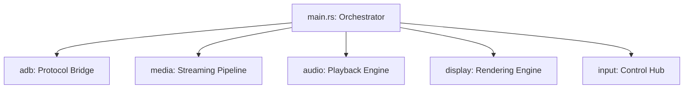

# Software System Overview (SSO): scrcpyrust

## 1. High-Level Architecture
scrcpyrust is built on a "Decoupled Data Stream" model. Each core component (Video, Audio, Control) operates on its own set of threads to minimize resource contention and optimize latency.

## 2. Module Breakdown

### 2.1 ADB (`src/adb/`)
The foundation. It handles the ADB wire protocol, tunneling, and server launch.
- `protocol.rs`: Binary message serialization/deserialization.
- `commands.rs`: Device selection and shell execution.
- `tunnel.rs`: Multiplexing TCP connections over ADB.

### 2.2 Server (`src/server/`)
Bridges the client options with the Android Java server.
- `params.rs`: Builds the complex set of arguments (71 CLI flags) passed to the server shell.
- `connection.rs`: Handshakes with the server to establish streams.

### 2.3 Media (`src/media/`)
The heavy lifter. Receives, decodes, and record streams.
- `demuxer.rs`: Synchronous reader that splits packets from the server.
- `decoder.rs`: FFmpeg-based hardware decoder with `get_format` HW acceleration.
- `recorder.rs`: MP4/MKV muxer with PTS normalization.
- `delay_buffer.rs`: Frame-based ring buffer for smoothing network jitter.

### 2.4 Audio (`src/audio/`)
High-fidelity audio playback.
- `player.rs`: SDL2 audio queue manager.
- `regulator.rs`: Dynamic resampling logic to keep the audio buffer at an ideal level.

### 2.5 Input (`src/input/`)
Translates local OS events to Android control messages.
- `manager.rs`: Event dispatcher, shortcut handler, and touch tracking.
- `hid_*.rs`: HID-level protocol handlers for UHID and AOA modes.
- `shortcuts.rs`: Mod-key bindings for common Android tasks.

### 2.6 Display (`src/display/`)
Visual representation.
- `screen.rs`: SDL2 windowing, texture management, and YUV/RGB shader pipeline.
- `fps_counter.rs`: Real-time performance monitoring.

## 3. Communication Patterns
- **crossbeam-channel**: Used for high-speed, lock-free packet and frame passing between demuxer, decoder, and renderer.
- **Arc<Mutex<T>>**: Used for shared configuration and state (e.g., Recorder, Controller) that must be accessible from multiple threads.
- **AtomicBool**: Used for graceful termination signals across the thread pool.
